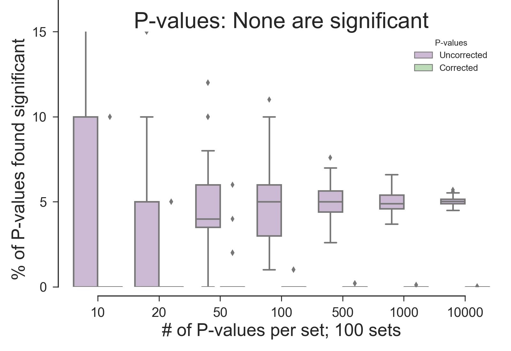

# Simulations of 

  * [P-value simulations](#p-value-simulations)
  * [Gene Ontology Enrichment Results (GOEA) simulations](#goea-simulations)

## P-value simulations
We use simulations to confirm the vericity of the statistical results of Gene Ontology Enrichment Analyses.
An alpha level of 0.05 is used for all simulations.    

First, we do P-value and multiple-test correction simulations to show how results vary with:
  * The number of P-values in one set    
  * The number of sets of P-values in one sample    
  * The number of P-values which have been set to be significant     

Then, we do Gene Ontology Enrichment Analyses simulations    

**Methods:**    
Random P-values between 0.0 and 1.0 are generated using a uniform distribution.
It is expected that 5% of the randomly generated P-values will appear to be significant (<0.05) by chance.
We generate P-value sets in set sizes ranging from 10 P-values per set to 10,000 P-values per set.

### P-values chosen randomly, with none being significant
Five percent of the randomly chosen uncorrected P-values are found to be significant, as expected.
These are shown in rose.
Upon doing multiple-test correction, practically no corrected P-values are found to be significant.
These are shown in green, but are so small that they appear to be a horizontal line around zero.

### P-values chosen randomly: 5% are significant 
TBD

### P-values chosen randomly: 10% are significant 
TBD

### P-values chosen randomly: 50% are significant 

## GOEA simulations    
TBD

Copyright (C) 2016-2017, DV Klopfenstein. All rights reserved.
