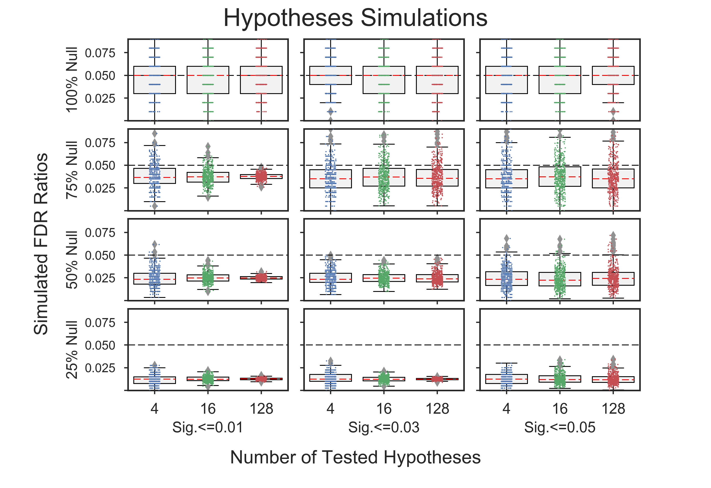

# Simulations to Verify GOEA Results
Stochastic simulations in this repository are used to investigate the results of
**Gene Ontology Enrichment Analyses** (**GOEAs**).

All simulations use [**Benjamini/Hochberg multiple test correction**](
http://www.stat.purdue.edu/~doerge/BIOINFORM.D/FALL06/Benjamini%20and%20Y%20FDR.pdf)
with **alpha=0.05**.

**There are two categories of simulations**:
  1. [**Preparatory**: Hypotheses and multiple-test simulations](
     #preparatory-hypotheses-and-multiple-test-simulations) (No gene ontology)
  2. [**Consequent**: Gene Ontology Enrichment Results (GOEA) simulations](
     #consequent-gene-ontology-enrichment-results-goea-simulations)

## Two categories of simulations (details):
### [**Preparatory**: Hypotheses and multiple-test simulations]()
Demonstrates that the mean False Discovery Rates (FDRs) resulting from simulations using randomly generated 
hypotheses test results centers around the alpha-level set by the user (0.05).

In fact, as larger percentages of the hypotheses are "Non-true null hypotheses"
(i.e. Null should be rejected; there is a difference between the study items and the population items),
the simulated FDR drops dramatically below the alpha(0.05).

The x-axis shows both the number of tested hypotheses, which is 4, 16, and 128 and
the maximum significance value of a randomly generated hypothesis test result.
The y-axis shows the percentage of "True nulls".
As the percentage of "True nulls" drops and the number of "Nontrue nulls" rises,
the simulated FDR drops dramatically.

### [**Consequent**: Gene Ontology Enrichment Results (GOEA) simulations]()

## Prerequisites

  * numpy
  * statsmodels
  * datetime
  * seaborn
  * pandas
  * goatools
  * goatools_suppl

Copyright (C) 2016-2017, DV Klopfenstein, Haibao Tang. All rights reserved.
