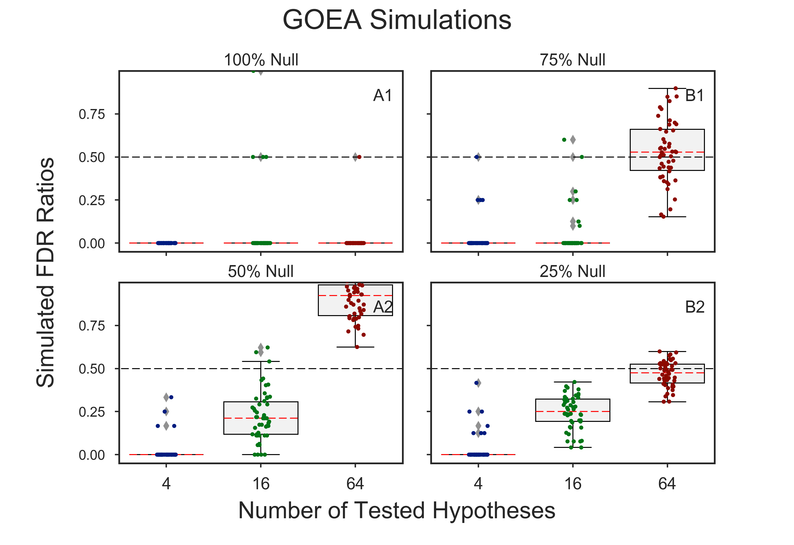
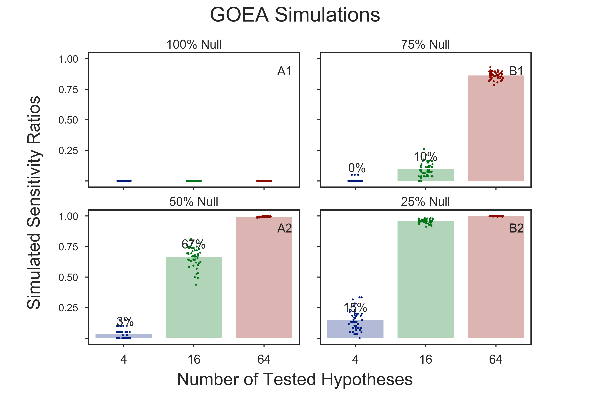

# Simulations to Verify GOEA Results
Stochastic simulations of multitudes of **Gene Ontology Enrichment Analyses**
are used to generate simulated values of FDR, sensitivity, and specificity
for GOEAs done using [GOATOOLS](https://github.com/tanghaibao/goatools).

**There are two categories of simulations**:
  1. [**Preparatory**: Hypotheses and multiple-test simulations](doc/md/README_prep1.md)    
     Simulation elements:    
       * Benjamini/Hochberg FDR simulation only
  2. [**Consequent**: Gene Ontology Enrichment Results (GOEA) simulations](
     #consequent-gene-ontology-enrichment-results-goea-simulations)    
     Simulation elements:    
       * Benjamini/Hochberg calculations    
       * gene ontology associations    
       * Fisher's exact test.    

All simulations use [**Benjamini/Hochberg multiple test correction**](
http://www.stat.purdue.edu/~doerge/BIOINFORM.D/FALL06/Benjamini%20and%20Y%20FDR.pdf)
with **alpha=0.05**.

## [**Consequent**: Gene Ontology Enrichment Results (GOEA) simulations]()

### Simulated FDR Ratios

### Simulated Sensitivity Ratios

## Prerequisites

  * numpy
  * statsmodels
  * datetime
  * seaborn
  * pandas
  * goatools
  * goatools_suppl

## Links

  * 1995 Benjamini & Hochberg's [**Controlling the False Discovery Rate: A Practical and Powerful Approach to Multiple Testing**](
    http://www.stat.purdue.edu/~doerge/BIOINFORM.D/FALL06/Benjamini%20and%20Y%20FDR.pdf)
  * [SciPy](https://docs.scipy.org/doc/scipy/reference/)'s
    [stats](https://docs.scipy.org/doc/scipy/reference/tutorial/stats.html) package:    
    * [Fishers exact test](https://docs.scipy.org/doc/scipy/reference/generated/scipy.stats.fisher_exact.htm)
    * [multipletests](http://www.statsmodels.org/stable/generated/statsmodels.sandbox.stats.multicomp.multipletests.html)
  * [Stomp on Step One](http://www.stomponstep1.com/) for Sensitivity, Specificity, and more    

Copyright (C) 2016-2017, DV Klopfenstein, Haibao Tang. All rights reserved.
