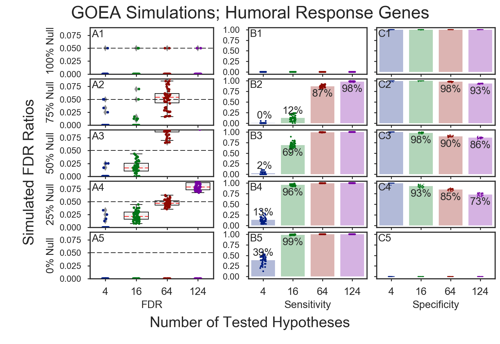
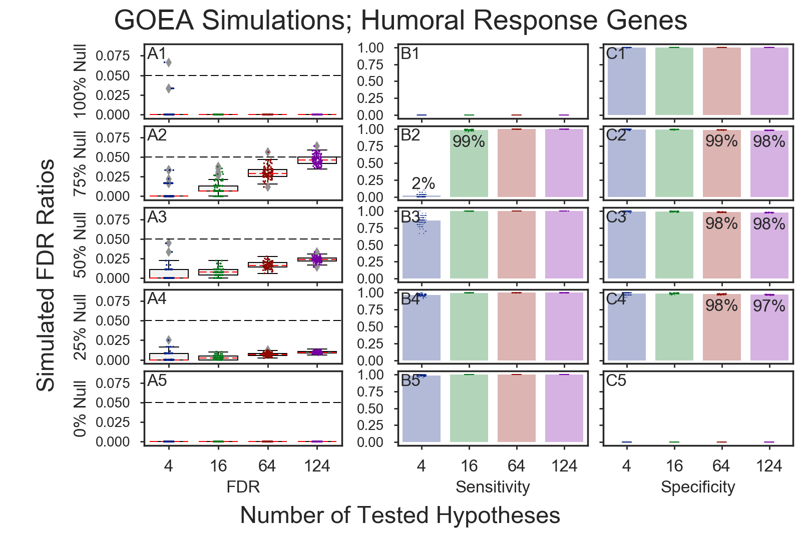
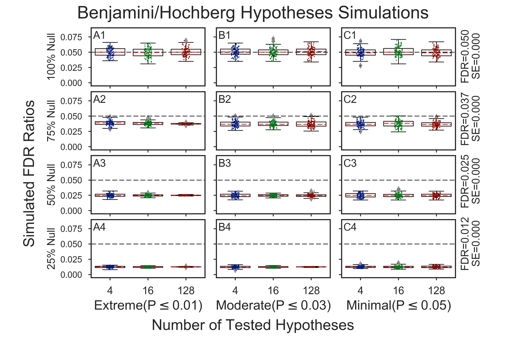
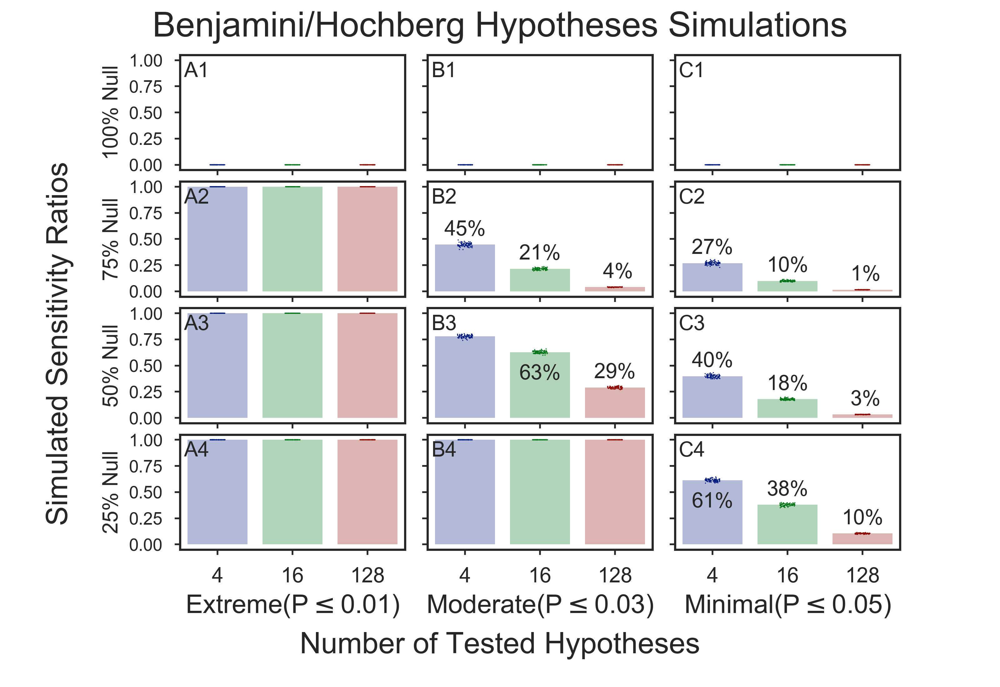

# Stochastic GOEA Simulations
Stochastic simulations of multitudes of **Gene Ontology Enrichment Analyses** (GOEAs)
are used to generate simulated values of **FDR**, **sensitivity**, and **specificity**
for GOEAs run using [GOATOOLS](https://github.com/tanghaibao/goatools).

**Two categories of simulations are contained herein**:
  1. [**Preparatory**: Hypotheses and multiple-test simulations](doc/md/README_prep1.md); elements include:    
       * Benjamini/Hochberg FDR simulation only
  2. [**Consequent**: Gene Ontology Enrichment Results (GOEA) simulations](#simulation-results); elements include
       * Fisher's exact test    
       * Benjamini/Hochberg calculations    
       * Gene ontology associations    

All simulations shown use [**Benjamini/Hochberg multiple test correction**](
http://www.stat.purdue.edu/~doerge/BIOINFORM.D/FALL06/Benjamini%20and%20Y%20FDR.pdf)
with **alpha=0.05**.

## Simulation results

### Table of Contents
  * [**Abstract**](#abstract)
  * [**Introduction**](#introduction)
  * [**Methods**](#methods)
  * [**Results and Discussion**](#results-and-discussion)    
      [**Fig 1.**](#figure-1-goea-simulations-with-downloaded-associations)
      **GOEA Simulations with downloaded Associations**      
      [**Fig 2.**](#figure-2-goea-simulations-with-associations-randomized-for-true-null-genes)
      **GOEA Simulations with Associations randomized for true null genes**     
      [**Fig 3.**](#figure-3-benjaminihochberg-only-simulated-fdr-values)
      **Benjamini/Hochberg-Only Simulated FDR values**      
      [**Fig 4.**](#figure-4-benjaminihochberg-only-simulated-sensitivity-values)
      **Benjamini/Hochberg-Only Simulated Sensitivity values**      
  * [**Conclusion**](#conclusion)
  * [**References**](#references)   

### Abstract
Stochastic simulations of multitudes of **Gene Ontology Enrichment Analyses** (GOEAs) are
run on sets of randomly generated gene lists which are various sizes and contain various
percentages of genes enriched with _Humoral response_.

The results are analyzed to determine the percentages the _Humoral response_ genes in the
study which are correctly discovered by the thousands of gene ontology analyses.

### Introduction
Using GOATOOLS grouping, we find over 2,000 genes having immune functions. A subset of the
immune genes is the 124 _Humoral Response_ genes, which are used as a background from
which to draw upon for the study groups in the simulations. Study group sizes in the
simulations include 4 genes, 16, 64, and all 124 _Humoral Response_ genes.

The null hypotheses is that the study genes are no different that the population genes.
The population genes in the simulations are the set of all protein-coding mouse genes
which have gene ontology associations, which is over 18,600 genes out a total of over
22,000 Ensembl genes.

The study groups are composed of various percentages of both true and false null
hypotheses.  True null hypotheses in the study group are selected at random from a large
general group of population genes.  False null hypotheses in the study group are selected
at random from the small group of 124 humoral response genes.

### Methods
A randomly generated gene list used in a single GOEA simulation can contain both
**true null genes** and **false null genes**.

**True null genes** are those that are randomly selected from the more than 18,000 genes in
the population which are not involved with humoral response. True null genes are intended
to be genes which have little to no difference between the study set and the population.

**False null genes** in these simulations are those that are randomly selected from the 
124 genes associated with humoral response. False null genes are intended to be genes
which are enriched in a specific function which in this simulation is humoral response.

GOATOOLS runs the GOEA and returns significant GO terms along with the study genes associated with
the significant GO term. 

The rows contain the input values of study genes and each gene's corresponding null value (True or False).    

The columns contain the results of the GOEA simuation which are the study genes and the reject value (True or False).    

|                     | **Fail to reject Null**	        | **Reject Null**
|---------------------|---------------------------------|-----------------
| **True Null Genes**	| True Negative	                  | False Positive (Type I Error)
| **False Null Gene**	| False Negative (Type II Error)	| True Positive

Combining the input and output information, the counts of true positives, true negatives,
false positives, and false negatives are obtained according to the table below. Many
simulations are run, resulting in a probability of true positives, true negative, false
positives, and false negatives. Many more simulations are completed, resulting in a
multitiude of probabilities having a distribuition which may be plotted and analyzed.

### Results and Discussion
The figures show values of simulated **FDRs**, **sensitivity**, and**specificity** over thousands of simulations.

**Sensitivity**, also known as "true positive rate", recall, "probability of detection", is
the proportion of false hypotheses (humoral respose genes in our study sets) which are
correctly detected as being significant.

**Specificity**, is the proportion of of true hypotheses (general population genes in the
study) which failed to reject the null (not declared as being significantly different that
the population).

#### Figure 1) GOEA Simulations with downloaded Associations

The percentage of humoral genes in the study (false nulls) that were discovered by gene
ontology analyses was high for all study gene group sizes of 64 genes or more 
(orange and magenta bars in panels B2, B3, B4, and B5).  For studies containing 16 genes, discovery was high with over
96% of all humoral genes in the study discovered when the study groups contained 75% or
100% humoral genes (Green bars, panels B4 and B5) . This value dipped to 69% humoral genes
discovered when the 16 gene group contained 8 humoral genes (green bar, panel B3) and was only 12%
discovery if there were 4 humoral genes in the study (green bar, panel B2).

When the study size was 4 genes, 0%-39% of all humoral response genes in the studies were discovered over
thousands of simulations as the percent of true null contents of the groups varied from 75%
true null (25% of the study genes are humoral resonse genes) to 0% true null (all of the
study genes are humoral response genes) shown in the figure above as blue bars in panels B2-B4.

The simulated FDR values, which are supposed to be guaranteed to be under the alpha value of 0.05
used in the simulations, was nearly 0.00 for the case where all genes are from the
population or all genes are from the set of genes enriched in humoral response (A1 and A5).
But the FDR rises above the alpha of 0.05 in the cases where there is a mix of
true null (genes from the population) and false null (genes enriched in humoral response),
especially for the study groups containing 64 or more genes (panels A2-A4). 

The FDRs in this simulation are artificially high because we are finding genes enriched in 
categories other than _humoral response_. We next randomize genes with true null associations
to remove the simulation artifact seen above.

#### Figure 2) GOEA Simulations with Associations randomized for true null genes
To simulate true FDRs, the original associations are randomized for all associations except for the _Non-True
Nulls_ (the humoral genes that are significantly different that the population of all
mouse genes) from a randomly chosen study set of genes.    

The results of the randomized association simulation were all simulated FDR values stayed
under the alpha of 0.05. Also, the sensitivity was that 99% or more of the humoral genes
in the study were discovered for all simulations except for two cases. The first case
found only 2% of all humoral genes over all simulations when using a 4-gene study group
where only 1 gene was a humoral response gene (Blue bar in B2). The second case showed a
sensitivity of 86% when the 4 gene-study group had 2 genes that were enriched in humoral
response genes (Blue bar in B3).

#### Figure 3) Benjamini/Hochberg-Only Simulated FDR values

It is interesting to note that the simulated FDR values in GOEA simulations vary by study
size in a single panel in Figure 2.  For example in Fig 2 panel A2, the mean simulated FDR is 0.004,
0.01, 0.03, and 0.04 for study group sizes of 4 genes, 16, 64 and 124. This is interesting
because in the Benjimini/Hochberg-only simulations that contain no gene ontology or Fisher
exact tests, the FDR stays the same for one set of simulations which all have the same “%
Null” contents across different group sizes of tested hypotheses. In the Benjamini/Hochberg-only
simulations the mean simulated FDR across the entire 75% null panel was 0.038 (Panels A2, B2, and B3) 

#### Figure 4) Benjamini/Hochberg-Only Simulated Sensitivity values

The sensitivity in Benjamini/Hochberg-only simulations is 100% when the study group
hypotheses test results (P-values) are 0.01 or below when the alpha is set to 0.05
(panels A2-A4).

As the hypotheses test results for false nulls are randomly generated at values closer to 0.05,
the sensitivity drops (B2-B4 and C2-C4)

### Conclusion
Gene ontology enrichment analyses can discover large proportions of
enriched study genes, especially when the study groups contain more
genes or when the study groups contain a higher percentage of enriched
genes. The simulated FDR can be as high as alpha, but becomes smaller
as the proportion of false nulls (general population unenriched genes)
drops.

### References

## Prerequisites

  * numpy
  * statsmodels
  * datetime
  * seaborn
  * pandas
  * goatools
  * goatools_suppl

## Links

  * 1995 Benjamini & Hochberg's [**Controlling the False Discovery Rate: A Practical and Powerful Approach to Multiple Testing**](
    http://www.stat.purdue.edu/~doerge/BIOINFORM.D/FALL06/Benjamini%20and%20Y%20FDR.pdf)
  * [SciPy](https://docs.scipy.org/doc/scipy/reference/)'s
    [stats](https://docs.scipy.org/doc/scipy/reference/tutorial/stats.html) package:    
    * [Fishers exact test](https://docs.scipy.org/doc/scipy/reference/generated/scipy.stats.fisher_exact.htm)
    * [multipletests](http://www.statsmodels.org/stable/generated/statsmodels.sandbox.stats.multicomp.multipletests.html)

  * [Statistical power and significance testing in large-scale genetic studies](https://www.nature.com/nrg/journal/v15/n5/full/nrg3706.html)
  * [Stomp on Step One](http://www.stomponstep1.com/) for Sensitivity, Specificity, and more    

Copyright (C) 2016-2017, DV Klopfenstein, Haibao Tang. All rights reserved.
