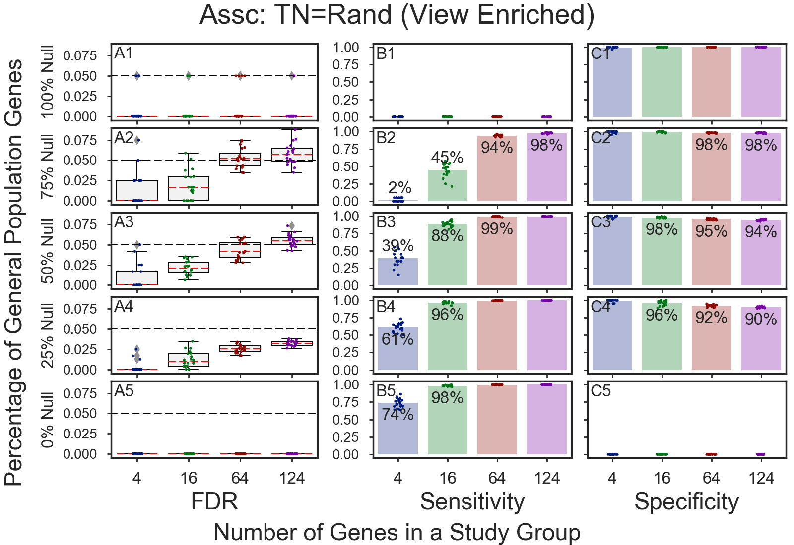
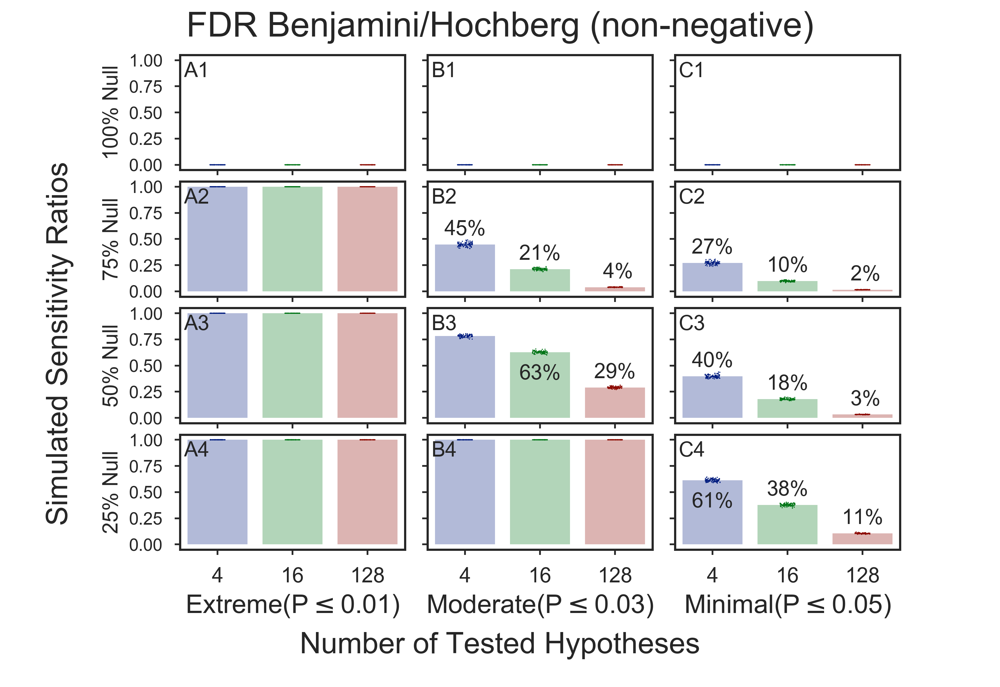

# Stochastic GOEA Simulations
Stochastic simulations of multitudes of **Gene Ontology Enrichment Analyses** (GOEAs)
are used to generate simulated values of **FDR**, **sensitivity**, and **specificity**
for **GOEAs** run using [GOATOOLS](https://github.com/tanghaibao/goatools).

**Two categories of simulations are contained herein**:
  1. [**Preparatory**: Hypotheses and multiple-test simulations](doc/md/README_bhfdr.md); elements include:    
       * FDR or FWER simulations only
  2. [**Consequent**: Gene Ontology Enrichment Results (GOEA) simulations](doc/md/README_goea.md); elements include:
       * Fisher's exact test
       * [Benjamini/Hochberg FDR multiple test corrections](http://www.stat.purdue.edu/~doerge/BIOINFORM.D/FALL06/Benjamini%20and%20Y%20FDR.pdf)
       * Gene ontology associations    

All simulations shown use **alpha=0.05**.

## Figure List
  * [**Stochastic GOEA simulations:**](#stochastic-goea-simulations-1)
    * [Original Simulations](#stochastic-goea-simulations-1)
      * [Enriched](#simulate-and-view-enriched-genes-only)
      * [Pruned](#purge-30-gos-from-association-then-simulate)
    * Random Simulations
      * [Rand Enriched](#randomize-association-and-view-enriched-genes-only)
      * [Rand Purged](#purge-30-gos-from-association-then-randomize)
  * [**Stochastic Benjamini/Hochberg-Only Simulations:**](#benjaminihochberg-only-simulations)
    * [Benjamini/Hochberg-Only Simulated FDRs](
      #benjaminihochberg-only-simulated-fdrs)
    * [Benjamini/Hochberg-Only Simulated Sensitivities](
      #benjaminihochberg-only-simulated-sensitivity)

## Stochastic GOEA simulations
First, we ran simulations using randomly generated gene lists containing varying
percentages of True Null (general population) genes and Non-True-Null (Humoral Response) genes.
The simulation results contained unacceptably high FDRs for some gene groups containing 64 or 124 genes. (Panels A3 and A4)

### Investigate Failures
Upon investigation, it was found the high numbers of false positives were often from:
  * GO IDs that are associated with an unusually high number of genes
  * GO IDs that are purified, rather than enriched

### Simulate and View Enriched Genes Only
If the simulations were re-run, but only the enriched results were used in reports and figures,
the simulations PASSED resulting in FDRs that were very close to zero.

### Purge 30 GOs from Association, then Simulate
If the simulations were re-run, but with ~30 GO IDs out of 17,000+ GO IDs in the
association stripped out of the association, the simulations also PASSED.
The 30 GO IDs were chosen to be purged because they were associated with more than 1000 genes.

### Stress tests
Upon doing a stress tests by randomizing the associations for True-Null genes
prior to simulation, the "enriched-gene" simulations FAILed, but the
"30-GOs-Purged" simulations PASSed.

### Randomize Association and View Enriched Genes Only
This simulation FAILs, but is close to passing.

### Purge 30 GOs from Association, then Randomize
This simulation PASSes.

## Benjamini/Hochberg-Only Simulations
Simulations of the underlying Benjamini/Hochberg multiple test correction are a subset
of the GOEA simulations.
Inputs to these simulations are hypotheses test results (P-values), versus the
inputs in GOEA simulations which are gene lists containing various percentages of enrichments.

### Simulation Inputs
The simulation inputs are groups of hypothesis test results (P-values) tagged as 
either **True nulls** and **Non-True nulls**:
  * **True Null**s are P-values randomly chosen from a uniform distribution of values between **0.0 to 1.0**.    
  * **Non-True Null**s (a.k.a **False Nulls**) are P-values randomly chosen from a uniform distribution of values between:    
    * **0.00 to 0.01** => **Extremely** different from the population.    
    * **0.00 to 0.03** => **Moderately** different from the population.    
    * **0.00 to 0.05** => **Minimally** different from the population.    

### Benjamini/Hochberg-Only Simulated FDRs

**Results show**:
  * The worst (highest) simulated FDR means are equal to the alpha (0.05)
    for all simulation sets with 100% **True Null** s (A1, B1, and C1).    
  * As the percentage of true nulls drops, the FDR also drops;    
    * row 1, with **100% True Null**, has the highest mean FDR (0.05), while
    * row 4, with   **0% True Null**, has the lowest mean FDR (0.012).
  * The simulated mean FDRs are the same across all study group sizes. For example, in A2    
    * the leftmost boxplot with blue dots showing the groups of 4 tested hypotheses has the same mean FDR as
    * the rightmost boxplot with red dots showing the groups of 128 tested hypotheses.

### Benjamini/Hochberg-Only Simulated Sensitivity

**Observations:**    
* **100%** of **Non-True Nulls** are **discovered** if their **uncorrected P-Value** is **Extreme** (below 0.01 when alpha is 0.05) (A2-A4)
* Moderate non-true null P-values (B2-B3) are discovered less frequently than extreme P-values (A2-A3).
* Minimal non-true null P-values (C2-C4) are discovered even less frequently than moderate P-values (B2-B4).
* Smaller groups of tested hypotheses (B3, blue bar) have more discoveries than larger groups (B3, red bar).

Copyright (C) 2016-2017, DV Klopfenstein, Haibao Tang. All rights reserved.
