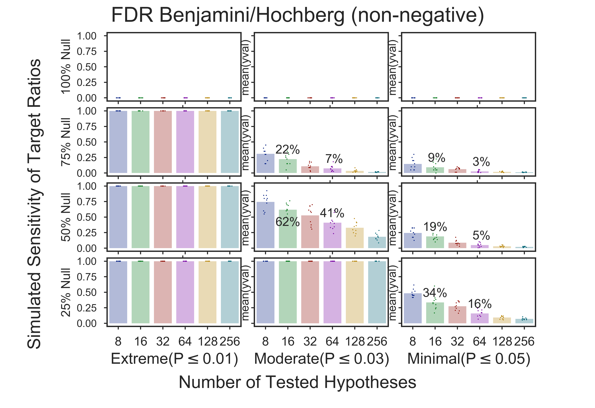
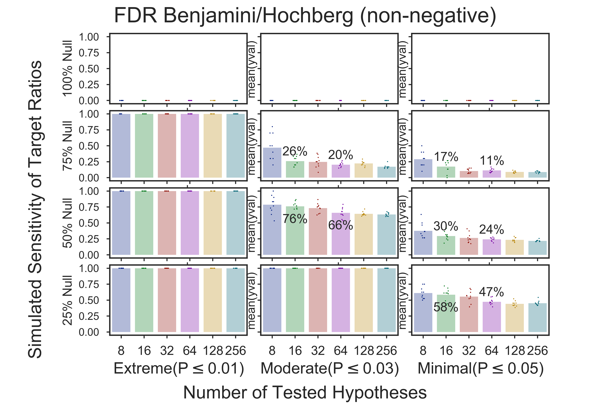
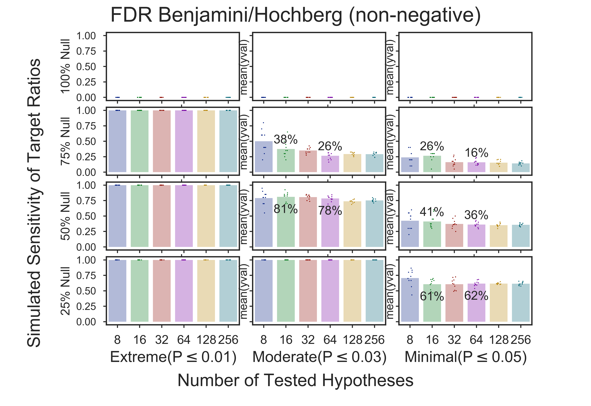
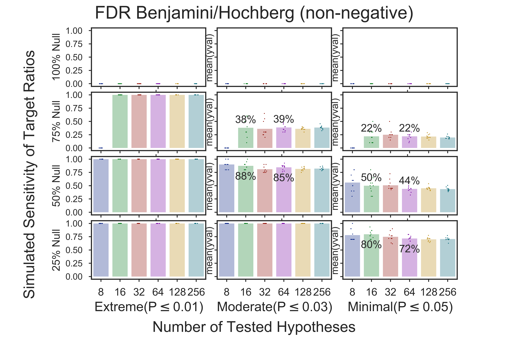

# Sensitivity of a target group given a highly enriched subset

# Target is 100%
No highly enriched subset    

# Target is 75%

# Target is 50%

# Target is 25%

Copyright (C) 2014-2018,DV Klopfenstein. All rights reserved
