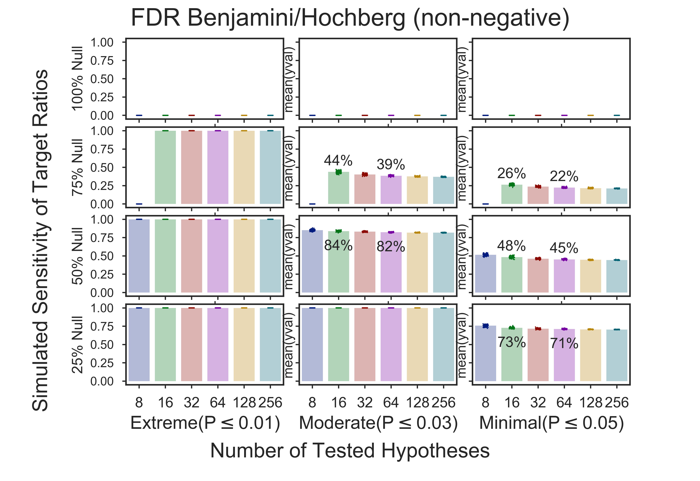

# Sensitivity of a target group given a highly enriched subset
$ src/bin/plt_fdr_bh_q1.py e=-3
                      0.01     0.03     0.05
max_sigpvals_super = [0.00001, 0.00001, 0.00001]


```
          72 Total sets
       7,200 Total FDRs;     100 FDRs/set
   7,200,000 Total sims;   1,000 sims/FDR
```


# Target is 100%
No highly enriched subset    


# Target is 75%


# Target is 50%


# Target is 25%


Copyright (C) 2014-present,DV Klopfenstein. All rights reserved
N00100_01000
