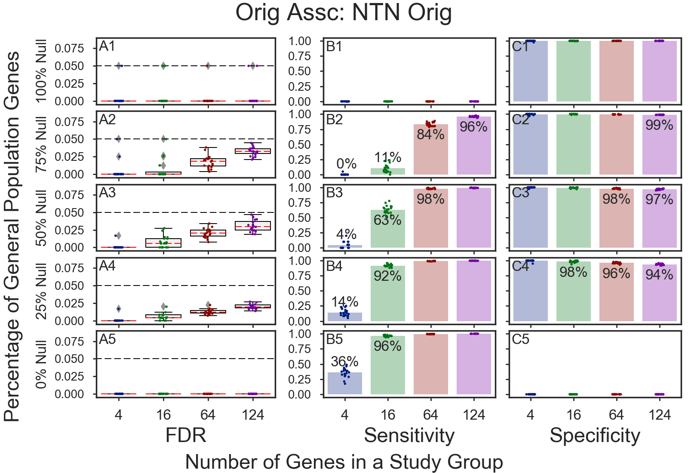
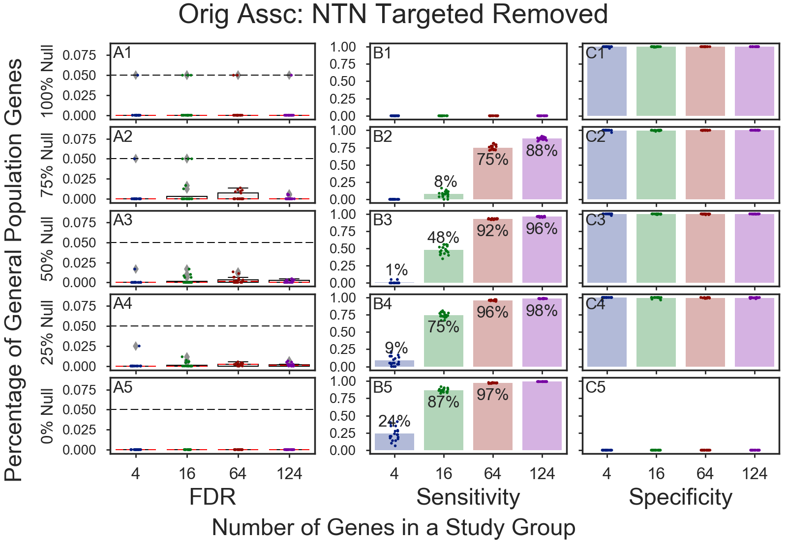

### 1)    3.   1 of   1 ./fig_goea_orig_100to000_004to124_N00020_00020_humoral_rsp.png    
    
### 3)    4.   1 of   1 ./fig_goea_orig_all_100to000_004to124_N00020_00020_humoral_rsp.png    
    
### 4)    5.   1 of   1 ./fig_goea_orig_ntn1_100to000_004to124_N00020_00020_humoral_rsp.png    
    
### 5)    6.   1 of   1 ./fig_goea_orig_ntn2_100to000_004to124_N00020_00020_humoral_rsp.png    
    
### 6)    7.   1 of   1 ./fig_goea_orig_ntn3_100to000_004to124_N00020_00020_humoral_rsp.png    
    
### 7)    8.   1 of   1 ./fig_goea_rand_rmgene5_ntn1_100to000_004to124_N00020_00020_humoral_rsp.png    
    
### 8)    9.   1 of   1 ./fig_goea_rm_tgtd_100to000_004to124_N00020_00020_humoral_rsp.png    
    
### 9)   10.   1 of   1 ./fig_goea_rnd_100to000_004to124_N00020_00020_humoral_rsp.png    
    
### 11)   12.   1 of   1 ./fig_goea_rnd_1_100to000_004to124_N00020_00020_humoral_rsp.png    
    
### 12)   13.   1 of   1 ./fig_goea_rnd_2_100to000_004to124_N00020_00020_humoral_rsp.png    
    
### 13)   14.   1 of   1 ./fig_goea_rnd_3_100to000_004to124_N00020_00020_humoral_rsp.png    
    
### 14)   15.   1 of   1 ./fig_goea_rnd_all_100to000_004to124_N00020_00020_humoral_rsp.png    
    
### 15)   16.   1 of   1 ./fig_goea_rnd_tgtd_100to000_004to124_N00020_00020_humoral_rsp.png    
    
### 16)   17.   1 of   1 ./fig_hypoth_100to025_01to05_004to016_N00020_00020_fdr_actual.png    
    
### 17)   18.   1 of   1 ./fig_hypoth_100to025_01to05_004to016_N00020_00020_sensitivity.png    
    
