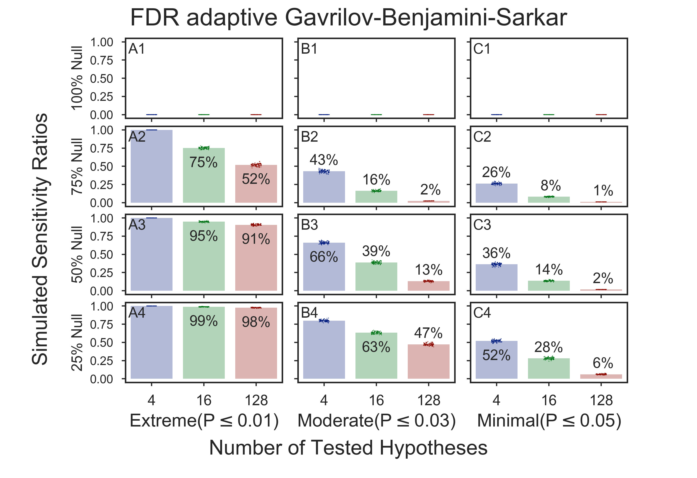
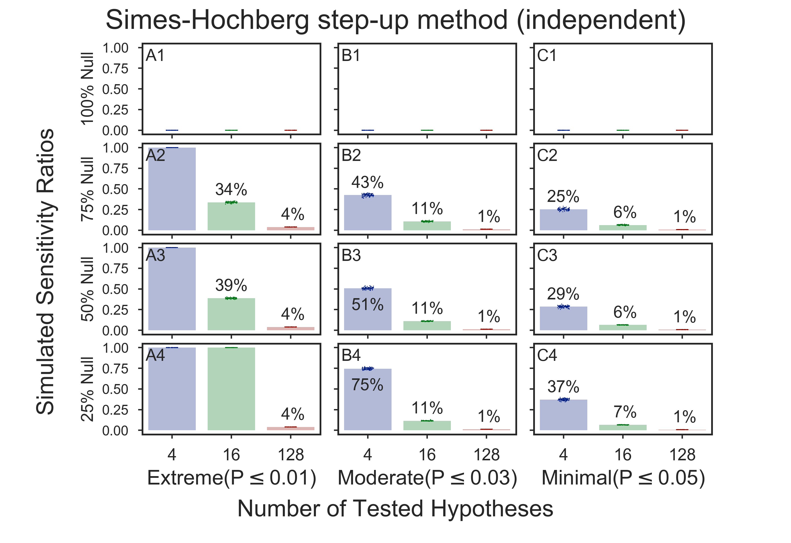
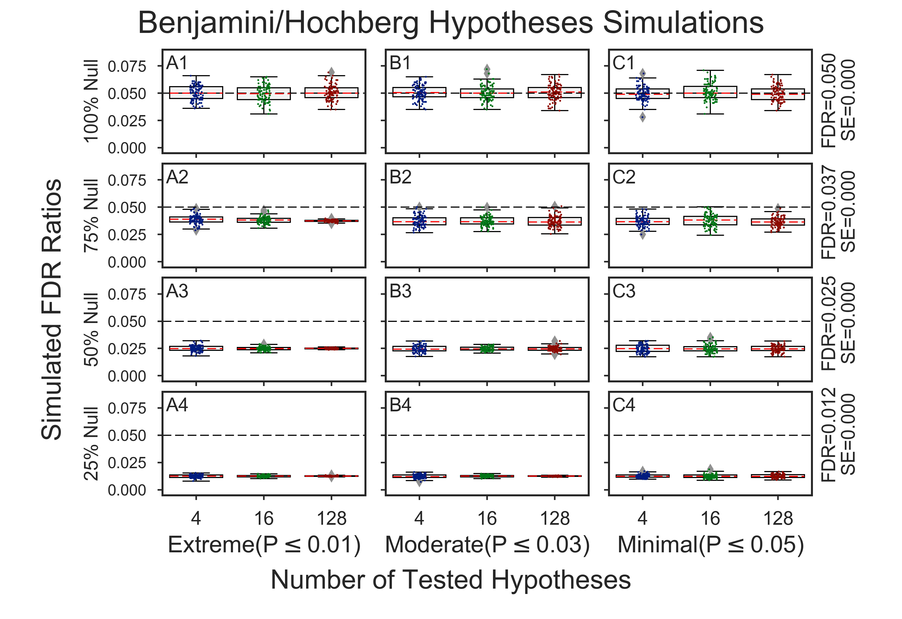
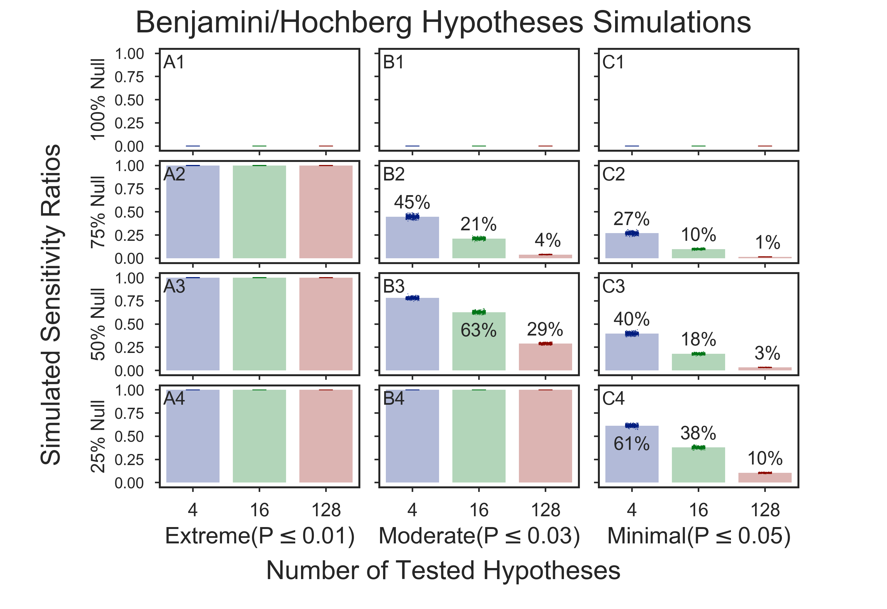

# Hypotheses Simulations

## Multiple-test methods
  * [Bonferroni one-step correction]()
  * [FDR Benjamini/Hochberg (non-negative)]()
  * [FDR Benjamini/Yekutieli (negative)]()
  * [FDR adaptive Gavrilov-Benjamini-Sarkar]()
  * [FDR 2-stage Benjamini-Hochberg (non-negative)]()
  * [FDR 2-stage Benjamini-Krieger-Yekutieli (non-negative)]()
  * [Holm-Sidak step-down method using Sidak adjustments]()
  * [Hommel closed method based on Simes tests (non-negative)]()
  * [Sidak one-step correction]()
  * [Simes-Hochberg step-up method (independent)]()
  * Holm step-down method using Bonferroni adjustments

## Bonferroni one-step correction
    
    
    

## FDR Benjamini/Hochberg (non-negative)
    
    
    

## FDR Benjamini/Yekutieli (negative)
    
    
    

## FDR adaptive Gavrilov-Benjamini-Sarkar
    
    
    

## FDR 2-stage Benjamini-Hochberg (non-negative)
    
    
    

## FDR 2-stage Benjamini-Krieger-Yekutieli (non-negative)
    
    
    

## Holm-Sidak step-down method using Sidak adjustments
    
    
    

## Hommel closed method based on Simes tests (non-negative)
    
    
    

## Sidak one-step correction
    
    
    

## Simes-Hochberg step-up method (independent)
    
    
    

## Misc
### 19)   20.   1 of   1 ./fig_hypoth_100to025_01to05_004to128_N00020_00200_sensitivity.png    
    
### 23)   24.   1 of   2 ./fig_hypoth_100to025_01to05_004to128_N00100_01000_fdr_actual.png    
    
### 45)   46.   1 of   2 ./fig_hypoth_100to025_01to05_004to128_N00100_01000_sensitivity.png    
    
### 52)   53.   1 of   1 ./fig_hypoth_100to025_01to05_004to128_N00500_01000_fdr_actual.png    
    
### 53)   54.   1 of   1 ./fig_hypoth_100to025_01to05_004to128_N00500_01000_sensitivity.png    
    
### 56)   57.   2 of   2 ./tmpdir/fig_hypoth_100to025_01to05_004to128_N00100_01000_fdr_actual.png    
    
### 57)   58.   2 of   2 ./tmpdir/fig_hypoth_100to025_01to05_004to128_N00100_01000_sensitivity.png    
    

Copyright (C) 2016-2017, DV Klopfenstein, Haibao Tang. All rights reserved
