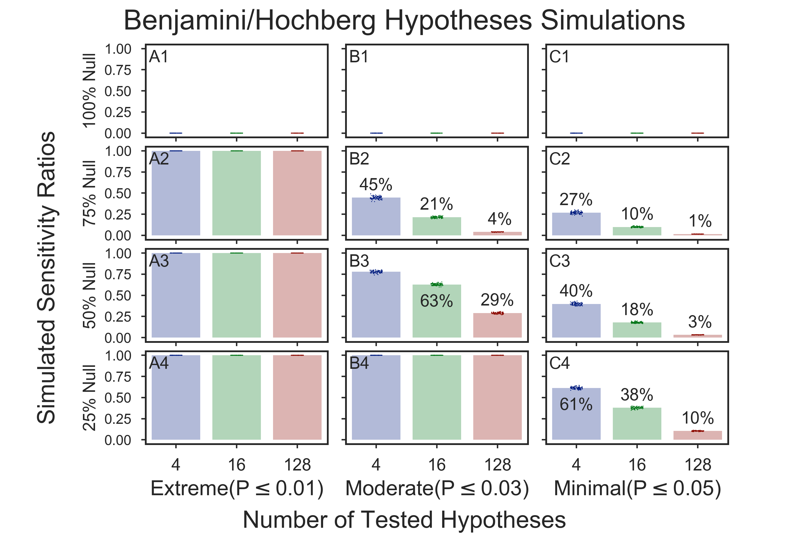

# Hypotheses Simulations

## Multiple-test methods
  * [Bonferroni one-step correction]()
  * [FDR Benjamini/Hochberg (non-negative)]()
  * [FDR Benjamini/Yekutieli (negative)]()
  * [FDR adaptive Gavrilov-Benjamini-Sarkar]()
  * [FDR 2-stage Benjamini-Hochberg (non-negative)]()
  * [FDR 2-stage Benjamini-Krieger-Yekutieli (non-negative)]()
  * [Holm-Sidak step-down method using Sidak adjustments]()
  * [Hommel closed method based on Simes tests (non-negative)]()
  * [Sidak one-step correction]()
  * [Simes-Hochberg step-up method (independent)]()
  * Holm step-down method using Bonferroni adjustments

## Bonferroni one-step correction
### 20)   21.   1 of   1 ./fig_hypoth_100to025_01to05_004to128_N00100_01000_bonferroni_fdr_actual.png    
    
### 21)   22.   1 of   1 ./fig_hypoth_100to025_01to05_004to128_N00100_01000_bonferroni_sensitivity.png    
    
### 22)   23.   1 of   1 ./fig_hypoth_100to025_01to05_004to128_N00100_01000_bonferroni_specificity.png    
    

## FDR Benjamini/Hochberg (non-negative)
### 24)   25.   1 of   1 ./fig_hypoth_100to025_01to05_004to128_N00100_01000_fdr_bh_fdr_actual.png    
    
### 25)   26.   1 of   1 ./fig_hypoth_100to025_01to05_004to128_N00100_01000_fdr_bh_sensitivity.png    
    
### 26)   27.   1 of   1 ./fig_hypoth_100to025_01to05_004to128_N00100_01000_fdr_bh_specificity.png    
    

## FDR Benjamini/Yekutieli (negative)
### 27)   28.   1 of   1 ./fig_hypoth_100to025_01to05_004to128_N00100_01000_fdr_by_fdr_actual.png    
    
### 28)   29.   1 of   1 ./fig_hypoth_100to025_01to05_004to128_N00100_01000_fdr_by_sensitivity.png    
    
### 29)   30.   1 of   1 ./fig_hypoth_100to025_01to05_004to128_N00100_01000_fdr_by_specificity.png    
    

## FDR adaptive Gavrilov-Benjamini-Sarkar
### 30)   31.   1 of   1 ./fig_hypoth_100to025_01to05_004to128_N00100_01000_fdr_gbs_fdr_actual.png    
    
### 31)   32.   1 of   1 ./fig_hypoth_100to025_01to05_004to128_N00100_01000_fdr_gbs_sensitivity.png    
    
### 32)   33.   1 of   1 ./fig_hypoth_100to025_01to05_004to128_N00100_01000_fdr_gbs_specificity.png    
    

## FDR 2-stage Benjamini-Hochberg (non-negative)
### 33)   34.   1 of   1 ./fig_hypoth_100to025_01to05_004to128_N00100_01000_fdr_tsbh_fdr_actual.png    
    
### 34)   35.   1 of   1 ./fig_hypoth_100to025_01to05_004to128_N00100_01000_fdr_tsbh_sensitivity.png    
    
### 35)   36.   1 of   1 ./fig_hypoth_100to025_01to05_004to128_N00100_01000_fdr_tsbh_specificity.png    
    

## FDR 2-stage Benjamini-Krieger-Yekutieli (non-negative)
### 36)   37.   1 of   1 ./fig_hypoth_100to025_01to05_004to128_N00100_01000_fdr_tsbky_fdr_actual.png    
    
### 37)   38.   1 of   1 ./fig_hypoth_100to025_01to05_004to128_N00100_01000_fdr_tsbky_sensitivity.png    
    
### 38)   39.   1 of   1 ./fig_hypoth_100to025_01to05_004to128_N00100_01000_fdr_tsbky_specificity.png    
    

## Holm-Sidak step-down method using Sidak adjustments
### 39)   40.   1 of   1 ./fig_hypoth_100to025_01to05_004to128_N00100_01000_holm-sidak_fdr_actual.png    
    
### 40)   41.   1 of   1 ./fig_hypoth_100to025_01to05_004to128_N00100_01000_holm-sidak_sensitivity.png   $ 
    
### 41)   42.   1 of   1 ./fig_hypoth_100to025_01to05_004to128_N00100_01000_holm-sidak_specificity.png    
    

## Hommel closed method based on Simes tests (non-negative)
### 42)   43.   1 of   1 ./fig_hypoth_100to025_01to05_004to128_N00100_01000_hommel_fdr_actual.png    
    
### 43)   44.   1 of   1 ./fig_hypoth_100to025_01to05_004to128_N00100_01000_hommel_sensitivity.png    
    
### 44)   45.   1 of   1 ./fig_hypoth_100to025_01to05_004to128_N00100_01000_hommel_specificity.png    
    

## Sidak one-step correction
### 46)   47.   1 of   1 ./fig_hypoth_100to025_01to05_004to128_N00100_01000_sidak_fdr_actual.png    
    
### 47)   48.   1 of   1 ./fig_hypoth_100to025_01to05_004to128_N00100_01000_sidak_sensitivity.png    
    
### 48)   49.   1 of   1 ./fig_hypoth_100to025_01to05_004to128_N00100_01000_sidak_specificity.png    
    

## Simes-Hochberg step-up method (independent)
### 49)   50.   1 of   1 ./fig_hypoth_100to025_01to05_004to128_N00100_01000_simes-hochberg_fdr_actual.png    
    
### 50)   51.   1 of   1 ./fig_hypoth_100to025_01to05_004to128_N00100_01000_simes-hochberg_sensitivity.png    
    
### 51)   52.   1 of   1 ./fig_hypoth_100to025_01to05_004to128_N00100_01000_simes-hochberg_specificity.png    
    

### 19)   20.   1 of   1 ./fig_hypoth_100to025_01to05_004to128_N00020_00200_sensitivity.png    
    
### 23)   24.   1 of   2 ./fig_hypoth_100to025_01to05_004to128_N00100_01000_fdr_actual.png    
    
### 45)   46.   1 of   2 ./fig_hypoth_100to025_01to05_004to128_N00100_01000_sensitivity.png    
    
### 52)   53.   1 of   1 ./fig_hypoth_100to025_01to05_004to128_N00500_01000_fdr_actual.png    
    
### 53)   54.   1 of   1 ./fig_hypoth_100to025_01to05_004to128_N00500_01000_sensitivity.png    
    
### 56)   57.   2 of   2 ./tmpdir/fig_hypoth_100to025_01to05_004to128_N00100_01000_fdr_actual.png    
    
### 57)   58.   2 of   2 ./tmpdir/fig_hypoth_100to025_01to05_004to128_N00100_01000_sensitivity.png    
    

Copyright (C) 2016-2017, DV Klopfenstein, Haibao Tang. All rights reserved
