# Actual FDR values from simulations

## No P-Values are significant

### 0)    1.   1 of   1 ./sim_fdr_actual_000_01.png    
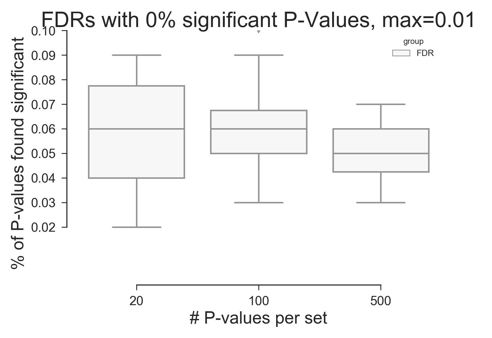    

### 1)    2.   1 of   1 ./sim_fdr_actual_000_03.png    
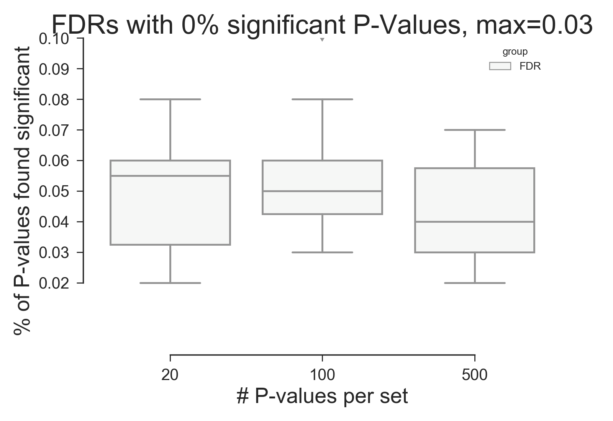    

### 2)    3.   1 of   1 ./sim_fdr_actual_000_05.png    
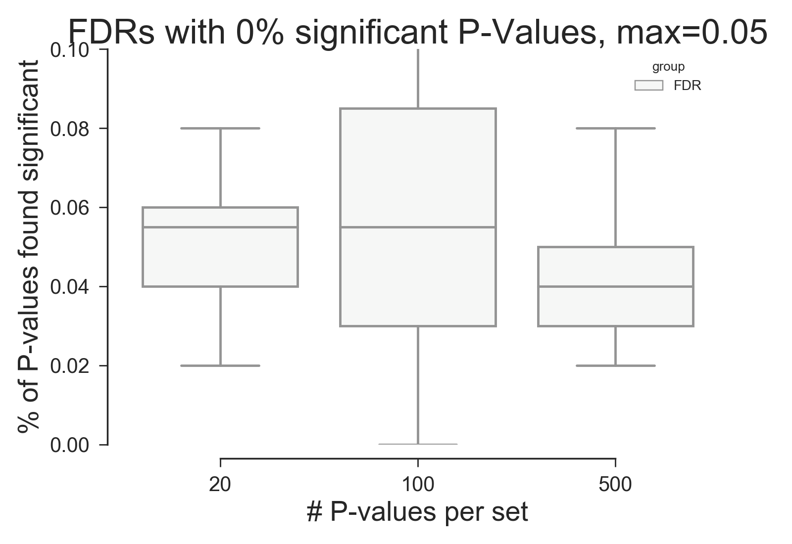    

## 25% of P-Values are significant

### 3)    4.   1 of   1 ./sim_fdr_actual_025_01.png    
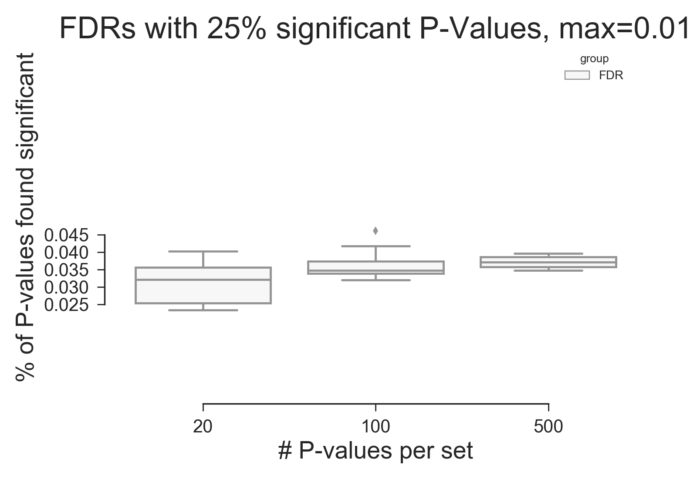    

### 4)    5.   1 of   1 ./sim_fdr_actual_025_03.png    
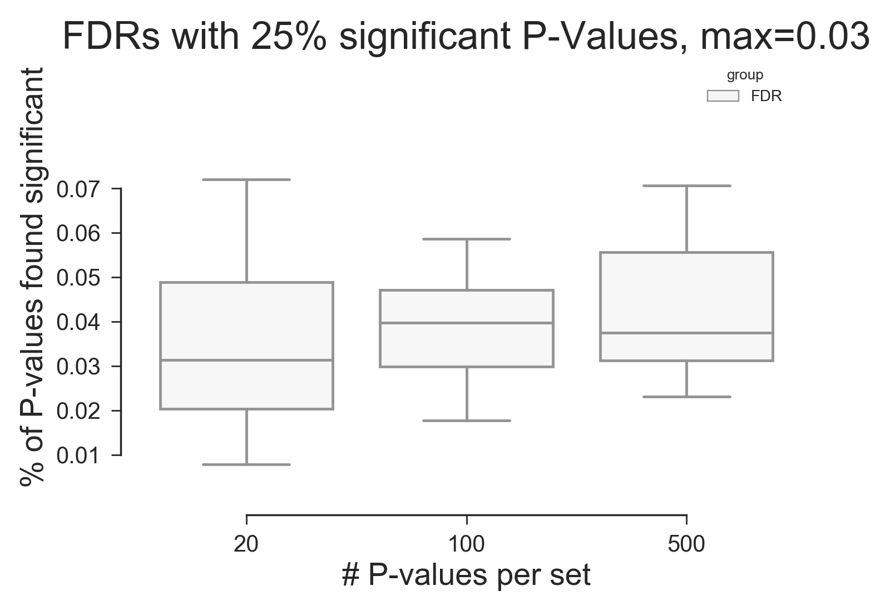    

### 5)    6.   1 of   1 ./sim_fdr_actual_025_05.png    
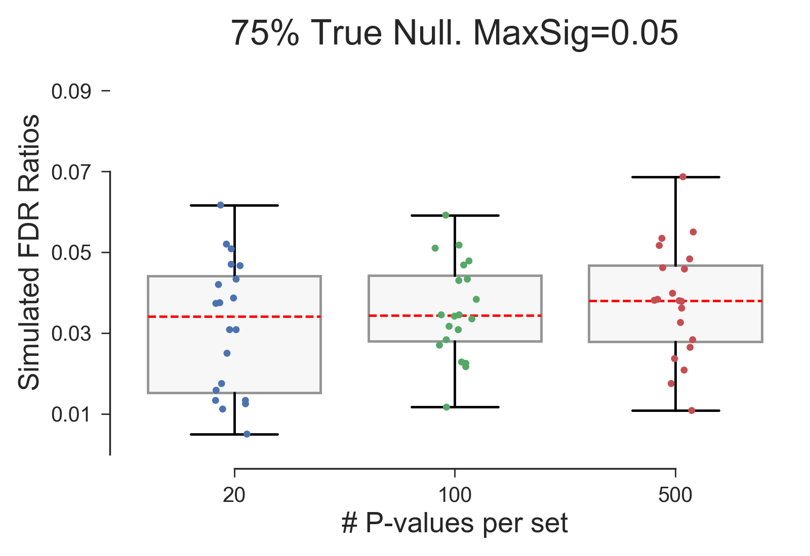    

## 50% of P-Values are significant

### 6)    7.   1 of   1 ./sim_fdr_actual_050_01.png    
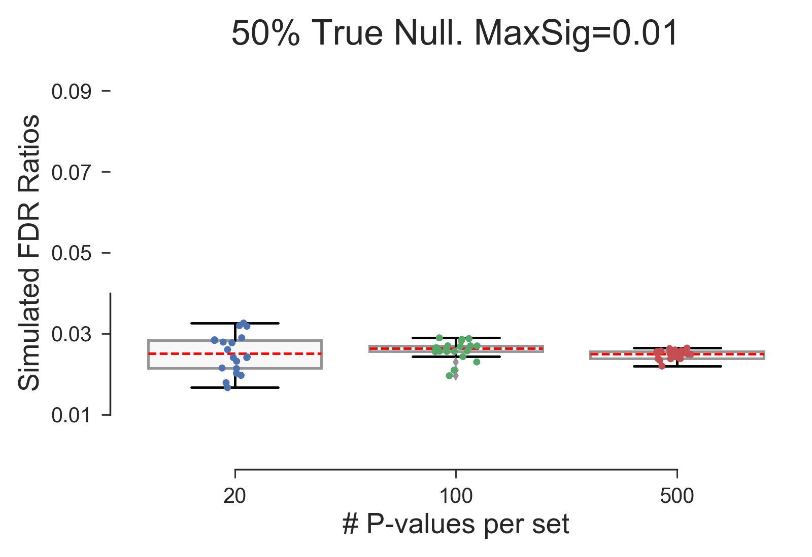    

### 7)    8.   1 of   1 ./sim_fdr_actual_050_03.png    
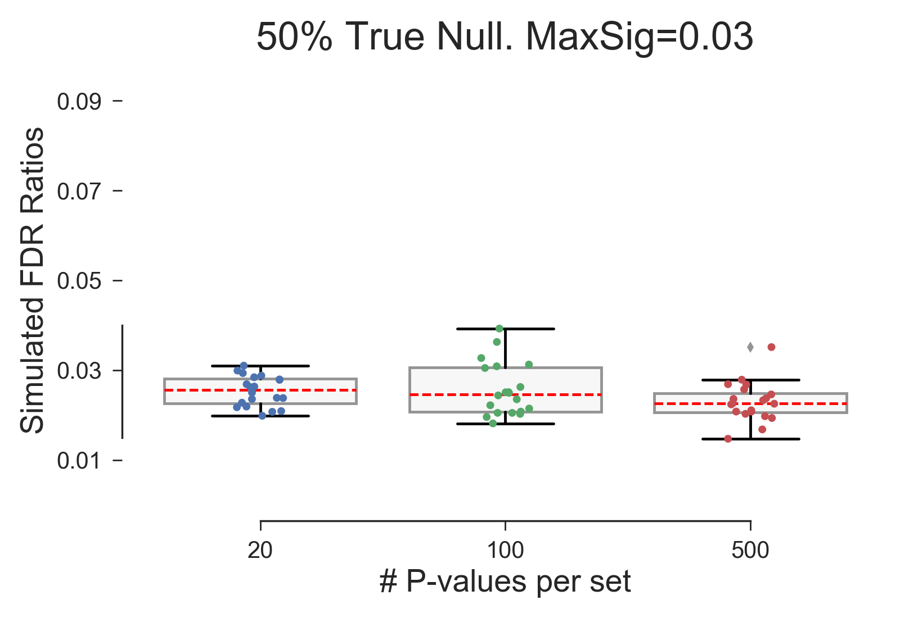    

### 8)    9.   1 of   1 ./sim_fdr_actual_050_05.png    
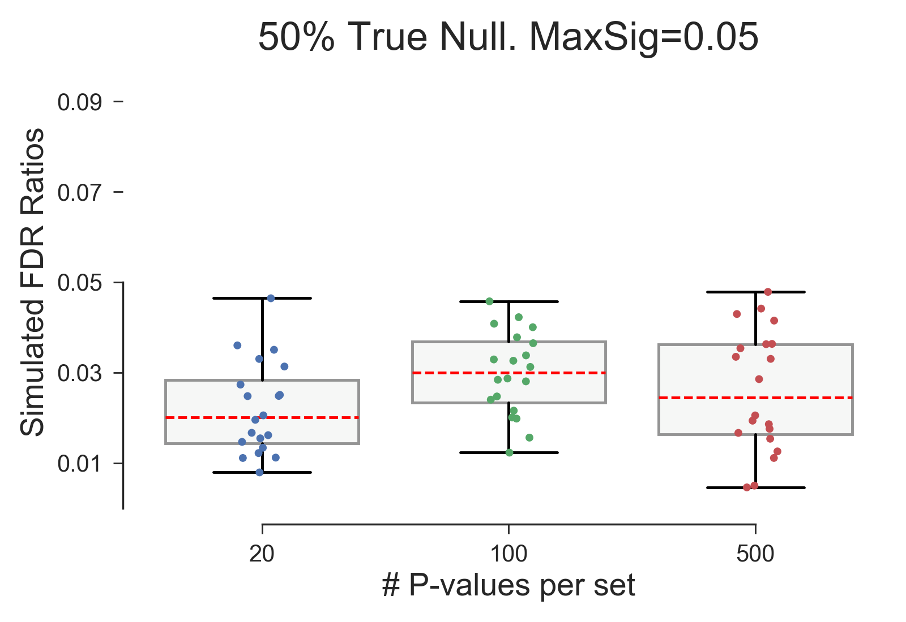    

## 75% of P-Values are significant

### 9)   10.   1 of   1 ./sim_fdr_actual_075_01.png    
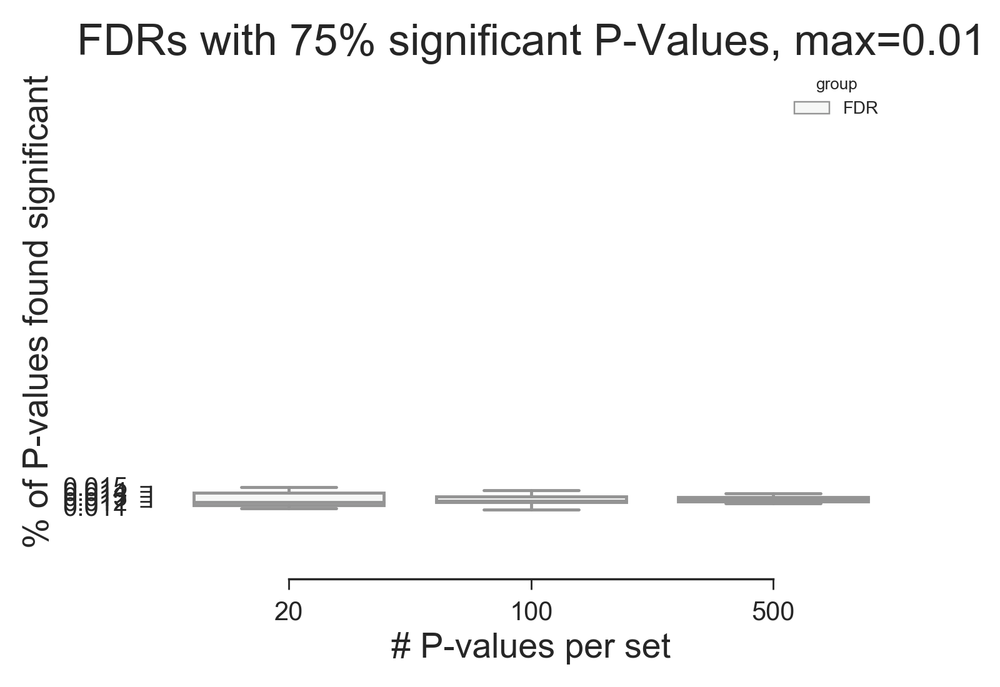    

### 10)   11.   1 of   1 ./sim_fdr_actual_075_03.png    
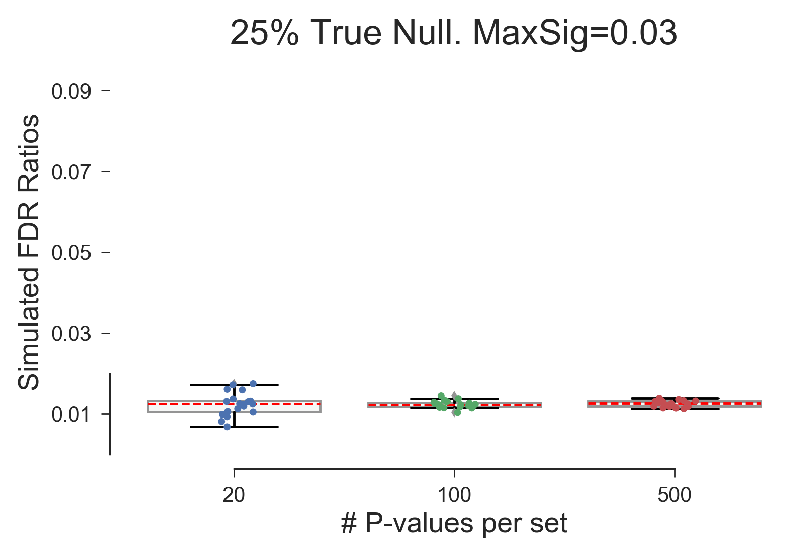    

### 11)   12.   1 of   1 ./sim_fdr_actual_075_05.png    
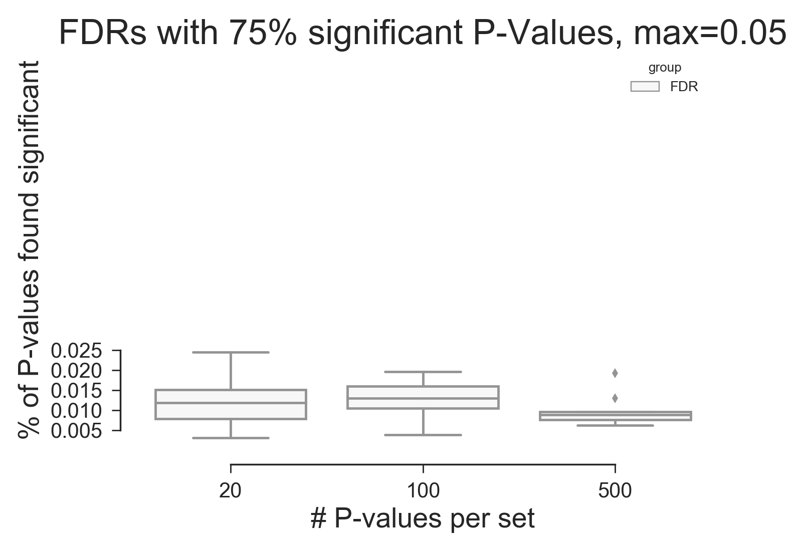    

Copyright (C) 2016-2017, DV Klopfenstein. All rights reserved.
