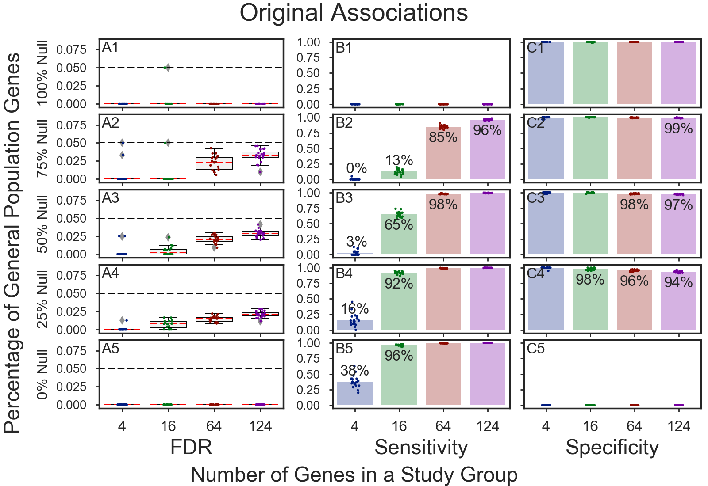
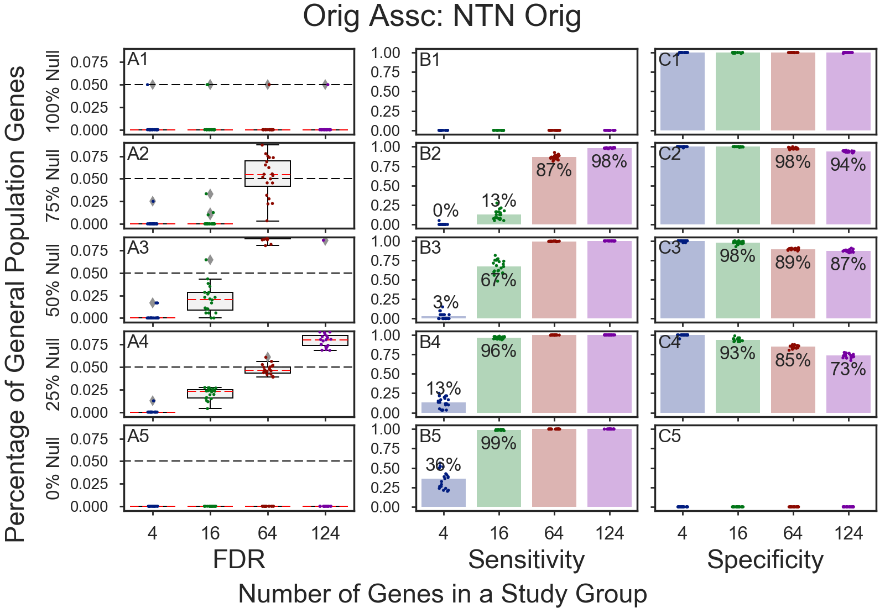
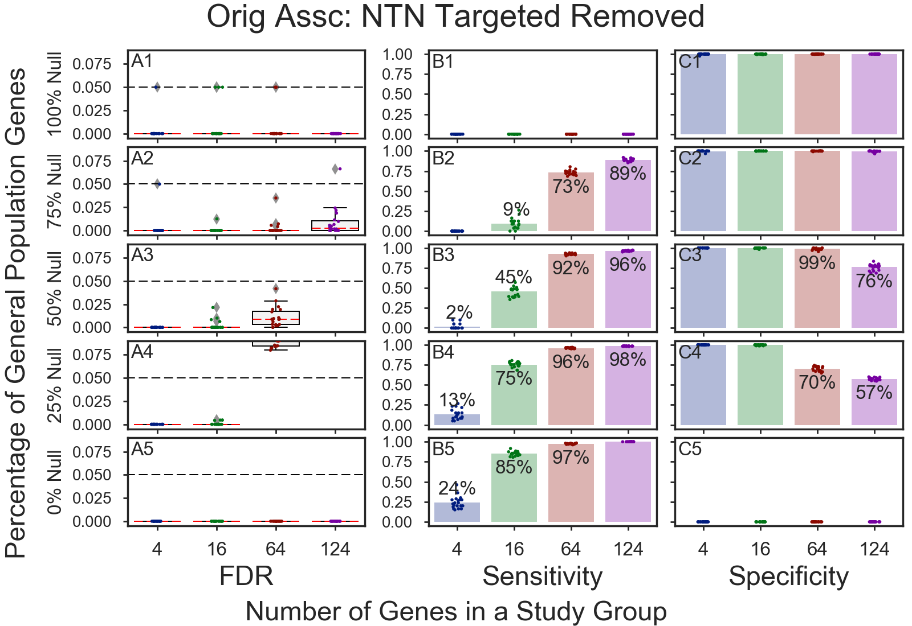
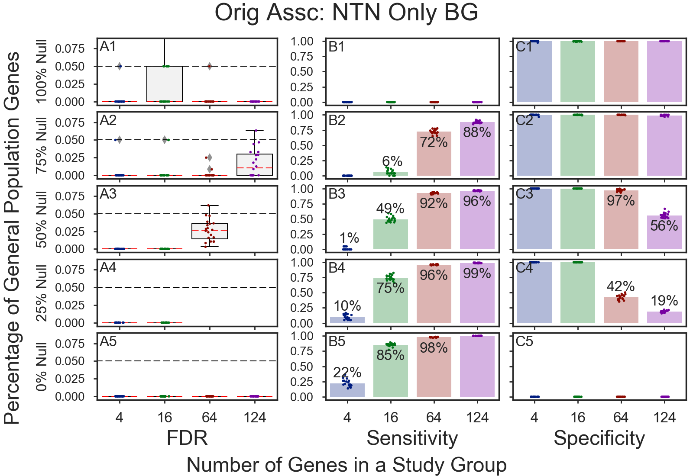
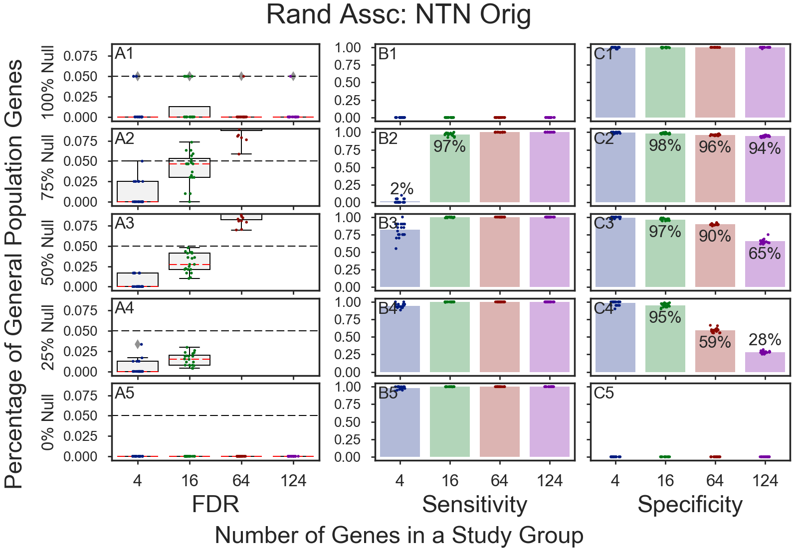
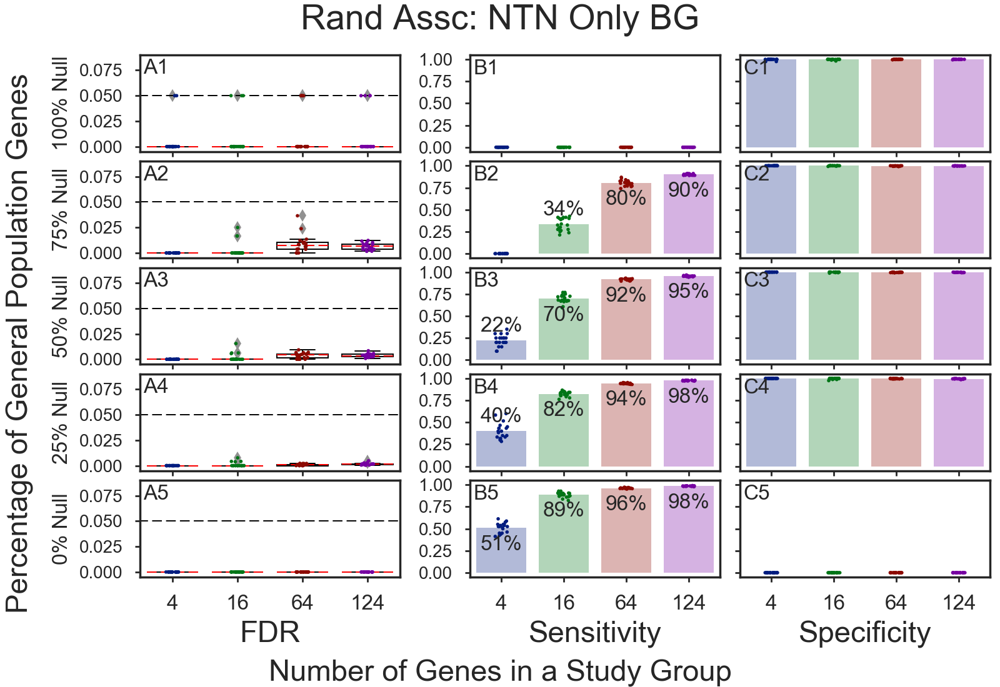

# GOEA Simulations

## Table of Contents
* [Association w/30 GOs removed](#association-w30-gos-removed)
* [Randomized Association w/30 GOs removed](#randomized-association-w30-gos-removed)

## Association w/30 GOs removed
    
    
    
    

## Randomized Association w/30 GOs removed
    
    
    
    

Copyright (C) 2016-2017. DV Klopfenstein, Haibao Tang. All rights reserved.
