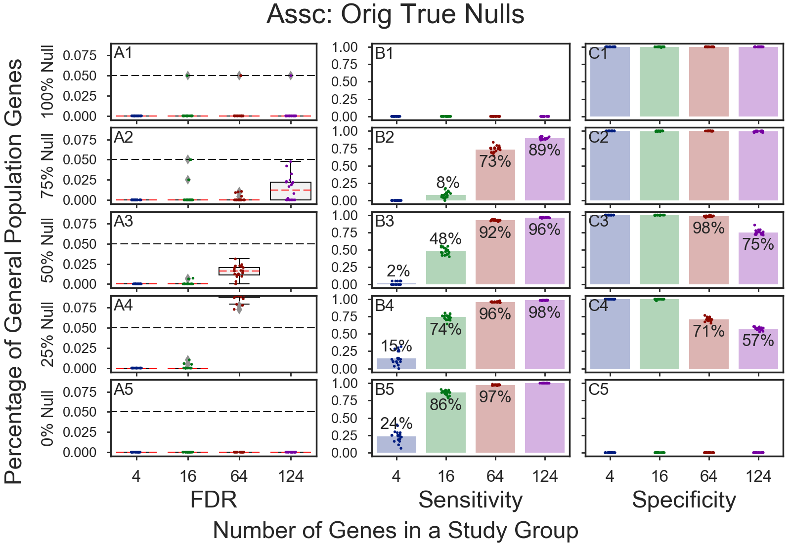
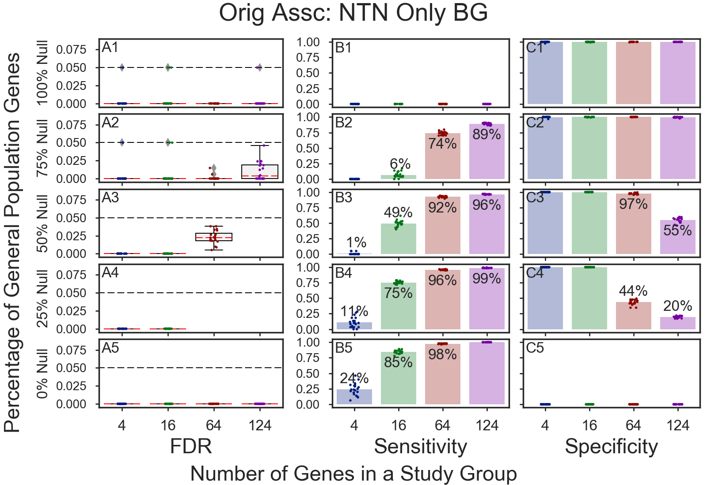

# GOEA Simulations
Shows GOEA simulation results using: 
  * Original/Randomized associations    
  * Original/Randomized associations w/[~30 GO IDs removedi](#go-terms-removed)    
  * Original/Randomized associations. Use only enriched results    

## Table of Contents
* [1a) Original Association](#original-association)
* 1b) Randomized Association
* Association is Original or Randomized; enriched GOs (not purified) only are used for calculations
  * [2a) Original Association, enriched GOs only](#original-association-enriched-gos-only)
  * [2b) Randomized Association, enriched GOs only](#randomized-association-enriched-gos-only)
* Association is Original or Randomized minus any [GOs associated with more than 1000 genes](#go-terms-removed)
  * [3a) Original Association w/30 GOs removed](#association-w30-gos-removed)
  * [3b) Randomized Association w/30 GOs removed](#randomized-association-w30-gos-removed)

## 1a) Original Association

## 2a) Original Association, enriched GOs only 
Includes 'unmarked' Non-True Null genes found to be enriched. Purified GO terms are removed.    
'Non-True Null' gene associations are the untouched original gene associations with GO terms    

### Original Association, enriched GOs only 

### Original Association, enriched GOs only 

## 2b) Randomized Association, enriched GOs only

### Randomized Association, enriched GOs only

### Randomized Association, enriched GOs only

### Randomized Association, enriched GOs only

## 3a) Association w/30 GOs removed
    
### Association w/30 GOs removed
    
### Association w/30 GOs removed
    

## 3b) Randomized Association w/30 GOs removed
    
### Randomized Association w/30 GOs removed
    
### Randomized Association w/30 GOs removed
    
### Randomized Association w/30 GOs removed
    

## GO terms removed
32 out of 17,276 GO terms are associated with more than 1,000 genes

| # genes | GO ID    |NS| dcnt | Level | Depth | L1 | Description
|---------|----------|--|------|-------|-------|----|---------------
| 1,807 | GO:0006810 |BP|1,648 | L03 | D03 | F   | transport
| 1,027 | GO:0007275 |BP|   22 | L03 | D03 | CEG | multicellular organism development
| 1,242 | GO:0007165 |BP|  724 | L02 | D04 | AB  | signal transduction
| 1,618 | GO:0007186 |BP|  100 | L03 | D05 | AB  | G-protein coupled receptor signaling pathway
| 1,077 | GO:0007608 |BP|    0 | L06 | D06 | G   | sensory perception of smell
| 2,064 | GO:0006355 |BP|  479 | L06 | D09 | A   | regulation of transcription, DNA-templated
| 1,842 | GO:0006351 |BP|   88 | L05 | D09 | BD  | transcription, DNA-templated
| 1,022 | GO:0045944 |BP|  109 | L08 | D11 | A   | positive regulation of transcription from RNA polymerase II promoter
| 6,921 | GO:0016020 |CC|  204 | L01 | D01 | E   | membrane
| 1,660 | GO:0005576 |CC|    4 | L01 | D01 | G   | extracellular region
| 3,704 | GO:0005886 |CC|    3 | L02 | D02 | AE  | plasma membrane
| 1,440 | GO:0005615 |CC|    0 | L02 | D02 | F   | extracellular space
| 5,296 | GO:0016021 |CC|   57 | L03 | D03 | C   | integral component of membrane
| 6,132 | GO:0005737 |CC|   24 | L03 | D03 | A   | cytoplasm
| 1,063 | GO:0005887 |CC|   15 | L04 | D04 | AC  | integral component of plasma membrane
| 2,764 | GO:0005829 |CC|    3 | L04 | D04 | A   | cytosol
| 1,127 | GO:0005856 |CC|   38 | L04 | D05 | AD  | cytoskeleton
| 5,704 | GO:0005634 |CC|   21 | L04 | D05 | AD  | nucleus
| 1,671 | GO:0005739 |CC|    6 | L04 | D05 | AD  | mitochondrion
| 1,349 | GO:0005783 |CC|    5 | L04 | D05 | AD  | endoplasmic reticulum
| 2,586 | GO:0070062 |CC|    0 | L04 | D05 | DF  | extracellular exosome
| 1,811 | GO:0005654 |CC|    0 | L04 | D05 | AB  | nucleoplasm
| 1,179 | GO:0005794 |CC|    0 | L04 | D05 | AD  | Golgi apparatus
| 1,656 | GO:0016740 |MF|2,418 | L02 | D02 | A   | transferase activity
| 1,514 | GO:0016787 |MF|1,618 | L02 | D02 | A   | hydrolase activity
| 4,544 | GO:0005515 |MF|1,005 | L02 | D02 | B   | protein binding
| 1,417 | GO:0003723 |MF|  173 | L04 | D04 | B   | RNA binding
| 1,727 | GO:0003677 |MF|  155 | L04 | D04 | B   | DNA binding
| 1,657 | GO:0000166 |MF|   53 | L03 | D04 | B   | nucleotide binding
| 2,945 | GO:0046872 |MF|   32 | L04 | D04 | B   | metal ion binding
| 1,050 | GO:0004984 |MF|    1 | L04 | D05 | CD  | olfactory receptor activity
| 1,368 | GO:0005524 |MF|    0 | L05 | D08 | B   | ATP binding

Copyright (C) 2016-2017. DV Klopfenstein, Haibao Tang. All rights reserved.
