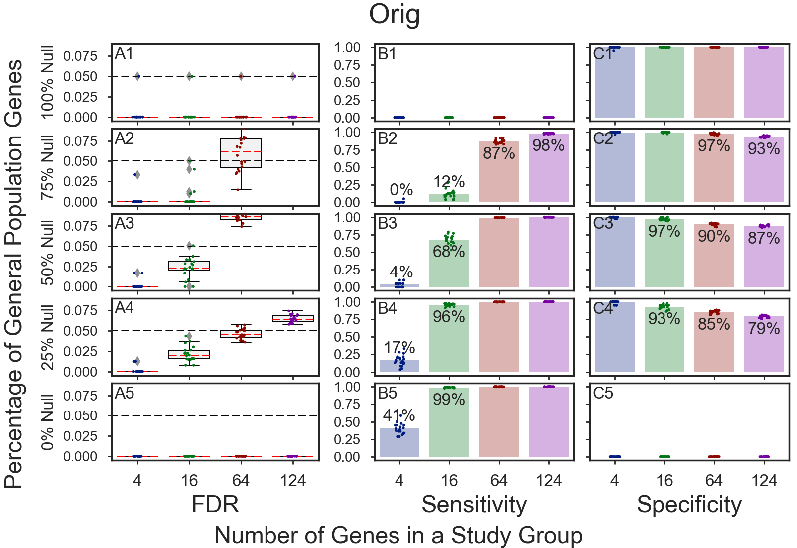
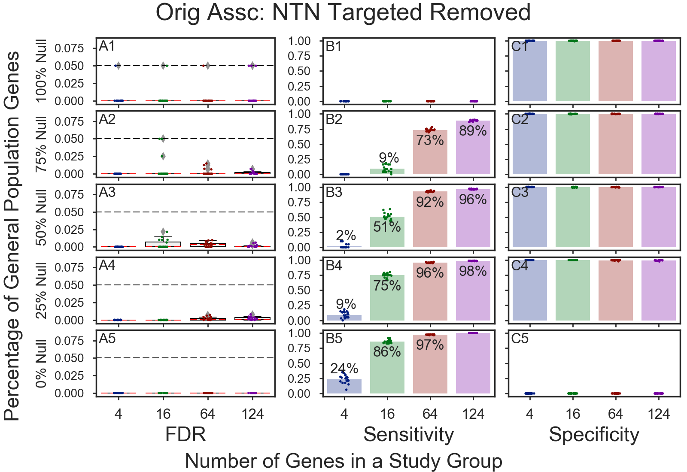
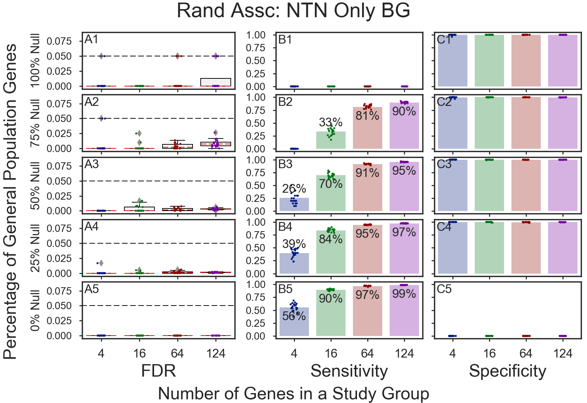
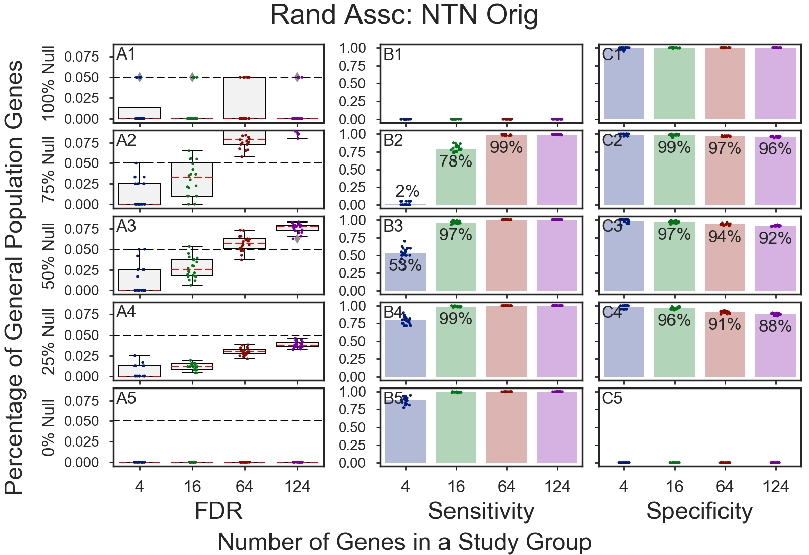

# GOEA Simulations
Shows GOEA simulation results using: 
  * Original/Randomized associations    
  * Original/Randomized associations w/~30 GO IDs removed    
  * Original/Randomized associations. Use only enriched results    

## Table of Contents
* Original Association 
* Randomized Association
* [Original Association, enriched GOs only](#original-association-enriched-gos-only)
* [Randomized Association, enriched GOs only](#randomized-association-enriched-gos-only)
* [Original Association w/30 GOs removed](#association-w30-gos-removed)
* [Randomized Association w/30 GOs removed](#randomized-association-w30-gos-removed)

## Original Association, enriched GOs only 

## Randomized Association, enriched GOs only

## Association w/30 GOs removed
    
    
    

## Randomized Association w/30 GOs removed
    
    
    
    

Copyright (C) 2016-2017. DV Klopfenstein, Haibao Tang. All rights reserved.
