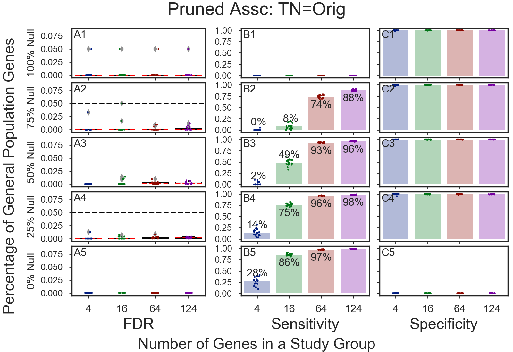
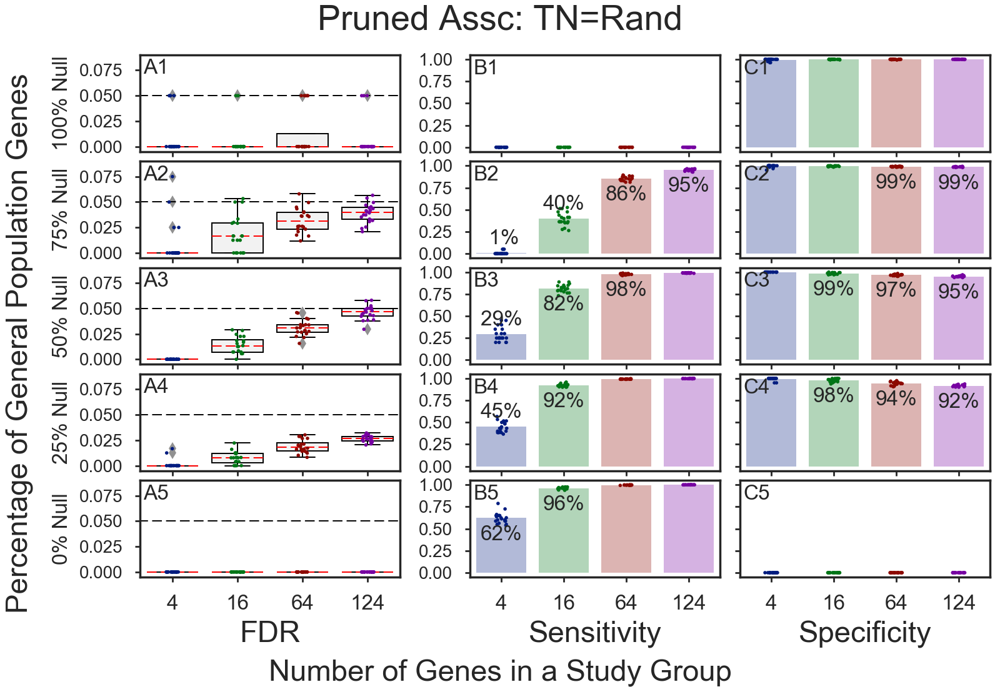

# Stochastic GOEA Simulations
Each figure was created with 8,000 GOEA stochastic simulations.    

## Table of Contents
  1. [**Introduction and Definitions**](#1-introduction-and-definitions)
  2. [**First Simulations**](#2-fail-first-simulations-using-original-associations):
     * **FAIL**: [First Simulations w/Original Associations unchanged.](#2-fail-first-simulations-using-original-associations)    
     * Simulations with Random True Null Associations look similar to those with Original Associations.    
  3. [**PASS: Original True-Null Associations w/Modification 1**](#3-pass-modification-1) (Assc. minus outliers):    
     Printed simulation result details showed that **most _False Positives_ are GO terms associated with over 1,000 genes**. 
     Therefore, re-run simulation after removing [~30 from the 17,000+ Mouse GO terms](#go-terms-removed)
     that are associated with 1,000+ genes.   
  4. [**PASS: Original True-Null Associations w/Modification 2**](#4-pass-modification-2): (View Enriched-Only)    
     Printed simulation result details showed that **many _False Positives_ are enriched**, rather than purified.     
     Therefore, re-run simulations using original associations, but only evaluate **enriched** GOEA results.
  5. [**FAIL: Random True-Null Associations w/Modification 2**](#5-randoms-wmodification-2) (View Enriched-Only)
  6. [**PASS: Random True-Null Associations w/Modification 1**](#6-randoms-wmodification-1) (Assc. minus outliers)
  7. [**PASS: Nominal Case: 100% of Associations are Randomly Shuffled**](#7-fail-randomized-true-nulls)     
     These nominal cases show that when **all** gene associations are randomly shuffled,
     no significant results are correctly returned.

## 1) Introduction and Definitions

1. **Simulation Inputs**
   * [**A) Study gene sets**](#a-study-gene-sets)
   * **B) Associations:**    
     * [**B1) Associations for True Nulls (Population genes)**](#b1-associations-for-true-nulls-population-genes)
     * [**B2) Associations for Non-True Nulls (Humoral Response genes)**](#b2-associations-for-non-true-nulls-humoral-response-genes)
2. **Simulation Results**
   * **PASS**: Simulated FDR means are all **below** alpha (0.05)     
   * **FAIL**: Some simulated FDR means are **above** alpha (0.05)    

### A) Study Gene Sets
Inputs gene sets are randomly chosen from either of two groups:
* **True-Null genes**: Chosen from the population of **Mouse protein-coding genes** having GO associations (~18,000 genes).    
* **Non-True Null genes**: Chosen from any of **124 Humoral Response genes**.

### B1) Associations for True Nulls (Population genes)    
Input gene/GO associations in the simulations are one of:
* **Original Associations** (18,000+ genes associated with 17,000+ GO IDs)
* **Original Associations w/Modification 1** (Assc. minus outliers)
* **Randomly shuffled Associations**
* **Randomly shuffled Associations w/Modification 1** (Assc. minus outliers)
**Modification 1** is removes all GO IDs from an association if the GO ID is associated with more than 1,000 genes.    

### B2) Associations for Non-True Nulls (Humoral Response genes)
* **Original Associations**    
  Genes enriched in _Humoral Response_ can also be enriched in other processes.
  Therefore, simulations may correctly return significant GO IDs other than _Humoral Response_ GOs.
  The original associations will contain both _Humoral Reponse_ genes properly marked as _Non-True Null_ genes
  and other genes correctly enriched in other functions, but not marked as _Non-True Null_.
* Original Associations minus signficant GO IDs that are **not** Humoral Response GOs 
* Original Associations minus all GO IDs except Humoral Response GOs    
  These simulations are expected to PASS    

## 2) FAIL: First Simulations using Original Associations
**Simulated FDRs exceed alpha(0.05) in the original simulation.**    
**False Positives are seen in all 3 images** showing various sets of 'Non-True Nulls' (aka Humoral Response genes)    
  * a) [Non-True Nulls use original associations](#2a-fail-non-true-nulls-use-original-associations)
  * b) [Non-True Nulls use original associations stripped of other significant GOs](#2b-fail-false-positives---non-true-nulls-wother-significant-discoveries-marked)
  * c) [Non-True Nulls only contain Humoral Response GO IDs](#2c-fail-false-positives---non-true-nulls-wonly-humoral-response-gos)
### 2a) FAIL: Non-True Nulls use original associations
  * FAIL in **A2** -> 124 genes, 64 genes
  * FAIL in **A3** -> 124 genes, 64 genes
  * FAIL in **A4** -> 124 genes    

Presents simulated values for FDR, sensitivity, and specificity when gene group sizes are varied from 4 genes to 124 genes and percentage of humoral response genes are varied from 0% to 100%. The gene groups are composed of 100% general population genes on row 1 and 100% enriched humoral response genes in row 5.
### 2b) FAIL: False Positives - Non-True Nulls w/other significant discoveries marked
  * FAIL in **A3** -> 124 genes, 64 genes
  * FAIL in **A4** -> 124 genes    

### 2c) FAIL: False Positives - Non-True Nulls w/ONLY Humoral Response GOs
  * FAIL in **A3** -> 124 genes, 64 genes
  * FAIL in **A4** -> 124 genes    

## 3) PASS: Modification 1 (Associations minus outliers)
**Because** printed simulation result details showed that
**most _False Positives_ are GO terms associated with over 1,000 genes**;    
**Re-ran simulations** after removing [~30 from the 17,000+ Mouse GO terms](#go-terms-removed)
that are associated with 1,000+ genes.   

**Results: All 3 Simulations PASS**
  * a) **PASS** [Non-True Nulls use original associations](#3a-fail-non-true-nulls-use-original-associations)
  * b) **PASS** [Non-True Nulls use original associations stripped of other significant GOs](#3b-fail-false-positives---non-true-nulls-wother-significant-discoveries-marked)
  * c) **PASS** [Non-True Nulls only contain Humoral Response GO IDs](#3c-fail-false-positives---non-true-nulls-wonly-humoral-response-gos)
### 3a) PASS: Non-True Nulls not marked
Unmarked Non-True Nulls can cause the appearance of an false positives.    
OBSERVATION: The false positives shown below are acceptable because they are below alpha (0.05).

Presents the same simulation as in Figure 3a, but with associations randomly shuffled for all genes that are not false nulls, i.e. the study genes enriched in humoral response. With true nulls now set to be random, the simulated FDR always falls under the 0.05 alpha setting. The sensitivity now shows nearly all false null genes (humoral response genes) to be discovered except in panel B2 for the 4 gene case where the sensitivity is ~2% and in panel B3 where the sensitivity for the 4 gene case is ~86% of all humoral response genes in the study are discovered.
### 3b) PASS: Non-True Nulls assc. w/significant discoveries are marked
OBSERVATION: If the unmarked Non-True Nulls are removed, the simulated FDRs are very close to zero.

### 3c) PASS: None-True Nulls w/ONLY Humoral Response GOs
OBSERVATION: If only the Humoral Response GO IDs exist in the Non-True Null gene-to-GOs associations,
FDRs are zero or almost zero.

## 4) PASS: Modification 2 (View Enriched Only)
**Because** the printed simulation result details showed that
**many _False Positives_ are enriched**, rather than purified;     
**Re-ran simulations** using original associations, but only evaluating **enriched** GOEA results.

**2 Simulations PASS. One is acceptable.**
  * a) **okay** [Non-True Nulls use original associations](#4a-fail-non-true-nulls-use-original-associations)
  * b) **PASS** [Non-True Nulls use original associations stripped of other significant GOs](#4b-fail-false-positives---non-true-nulls-wother-significant-discoveries-marked)
  * c) **PASS** [Non-True Nulls only contain Humoral Response GO IDs only](#4c-fail-false-positives---non-true-nulls-wonly-humoral-response-gos)
### 4a) okay: Non-True Nulls not marked

### 4b) PASS: Non-True Nulls assc. w/significant discoveries are marked

### 4c) PASS: None-True Nulls w/ONLY Humoral Response GOs

## 5) Randoms w/Modification 2 (View Enriched Only)
  * a) **okay** [Non-True Nulls use original associations](#5a-okay-non-true-nulls-use-original-associations)
  * b) **FAIL** [Non-True Nulls use original associations stripped of other significant GOs](#5b-fail-false-positives---non-true-nulls-wother-significant-discoveries-marked)
  * c) **PASS** [Non-True Nulls only contain Humoral Response GO IDs only](#5c-fail-false-positives---non-true-nulls-wonly-humoral-response-gos)
### 5a) okay: Non-True Nulls not marked

### 5b) FAIL: Non-True Nulls assc. w/significant discoveries are marked

### 5c) PASS: None-True Nulls w/ONLY Humoral Response GOs

## 6) Randoms w/Modification 1 (Associations minus outliers)
PASS: Prune GOs w/>1000 genes from Association acceptable? Try Randoms
  * a) **okay** [Non-True Nulls use original associations](#6a-okay-non-true-nulls-use-original-associations)
  * b) **PASS** [Non-True Nulls use original associations stripped of other significant GOs](#6b-fail-false-positives---non-true-nulls-wother-significant-discoveries-marked)
  * c) **PASS** [Non-True Nulls only contain Humoral Response GO IDs only](#6c-fail-false-positives---non-true-nulls-wonly-humoral-response-gos)
### 6a) okay: Non-True Nulls not marked
These simulations are acceptable because the simulated FDRs that are greater
than alpha are an artifact of including truly significant non-Humoral-Response
GO IDs that are associated with study genes that have not been marked with
'Non-True Null.'

### 6b) PASS: Non-True Nulls assc. w/significant discoveries are marked
Randomization of associations for True Null genes can cause some GO IDs to
appear significant, when they are not. These GO IDs cause the trend seen below
of increasing FDRs as study size increases.    

Stripping truly significant non-HR GO IDs that are associated with study genes
that are not been marked with 'Non-True Null' removes the artifact of a
artificially raised FDR rate. The truly significant non-HR GO IDs correctly are
seen as a discovery.

### 6c) PASS: None-True Nulls w/ONLY Humoral Response GOs
Nominal test case where only HR GO IDs are retained for 'Non-True-Null' genes in the association.
The simulations confirm the expectation that the simulated FDR is zero or nearly zero.

# ALL RAND) PASS: Various runs of All Associations Randomized
These nominal cases show that when **all** gene associations are randomly shuffled,
no significant results are correctly returned.

**PASS**: No change to Association.

**PASS**: No change to Association. Retain enriched GOEA results and do not assess the purified GOEA results.    

**PASS**: GOs with more than 1000 genes pruned

## GO terms removed
32 out of 17,276 GO terms are associated with more than 1,000 genes

| # genes | GO ID    |NS| dcnt | Level | Depth | L1 | Description
|---------|----------|--|------|-------|-------|----|---------------
| 1,807 | GO:0006810 |BP|1,648 | L03 | D03 | F   | transport
| 1,027 | GO:0007275 |BP|   22 | L03 | D03 | CEG | multicellular organism development
| 1,242 | GO:0007165 |BP|  724 | L02 | D04 | AB  | signal transduction
| 1,618 | GO:0007186 |BP|  100 | L03 | D05 | AB  | G-protein coupled receptor signaling pathway
| 1,077 | GO:0007608 |BP|    0 | L06 | D06 | G   | sensory perception of smell
| 2,064 | GO:0006355 |BP|  479 | L06 | D09 | A   | regulation of transcription, DNA-templated
| 1,842 | GO:0006351 |BP|   88 | L05 | D09 | BD  | transcription, DNA-templated
| 1,022 | GO:0045944 |BP|  109 | L08 | D11 | A   | positive regulation of transcription from RNA polymerase II promoter
| 6,921 | GO:0016020 |CC|  204 | L01 | D01 | E   | membrane
| 1,660 | GO:0005576 |CC|    4 | L01 | D01 | G   | extracellular region
| 3,704 | GO:0005886 |CC|    3 | L02 | D02 | AE  | plasma membrane
| 1,440 | GO:0005615 |CC|    0 | L02 | D02 | F   | extracellular space
| 5,296 | GO:0016021 |CC|   57 | L03 | D03 | C   | integral component of membrane
| 6,132 | GO:0005737 |CC|   24 | L03 | D03 | A   | cytoplasm
| 1,063 | GO:0005887 |CC|   15 | L04 | D04 | AC  | integral component of plasma membrane
| 2,764 | GO:0005829 |CC|    3 | L04 | D04 | A   | cytosol
| 1,127 | GO:0005856 |CC|   38 | L04 | D05 | AD  | cytoskeleton
| 5,704 | GO:0005634 |CC|   21 | L04 | D05 | AD  | nucleus
| 1,671 | GO:0005739 |CC|    6 | L04 | D05 | AD  | mitochondrion
| 1,349 | GO:0005783 |CC|    5 | L04 | D05 | AD  | endoplasmic reticulum
| 2,586 | GO:0070062 |CC|    0 | L04 | D05 | DF  | extracellular exosome
| 1,811 | GO:0005654 |CC|    0 | L04 | D05 | AB  | nucleoplasm
| 1,179 | GO:0005794 |CC|    0 | L04 | D05 | AD  | Golgi apparatus
| 1,656 | GO:0016740 |MF|2,418 | L02 | D02 | A   | transferase activity
| 1,514 | GO:0016787 |MF|1,618 | L02 | D02 | A   | hydrolase activity
| 4,544 | GO:0005515 |MF|1,005 | L02 | D02 | B   | protein binding
| 1,417 | GO:0003723 |MF|  173 | L04 | D04 | B   | RNA binding
| 1,727 | GO:0003677 |MF|  155 | L04 | D04 | B   | DNA binding
| 1,657 | GO:0000166 |MF|   53 | L03 | D04 | B   | nucleotide binding
| 2,945 | GO:0046872 |MF|   32 | L04 | D04 | B   | metal ion binding
| 1,050 | GO:0004984 |MF|    1 | L04 | D05 | CD  | olfactory receptor activity
| 1,368 | GO:0005524 |MF|    0 | L05 | D08 | B   | ATP binding

## How Associations are Shuffled
The gene-GOs associations are shuffled using this method:
1) A list of **gene to '# of GO IDs'** is created
2) The list of **gene to '# of GO IDs'** is shuffled
3) 

Copyright (C) 2016-present. DV Klopfenstein, Haibao Tang. All rights reserved.
