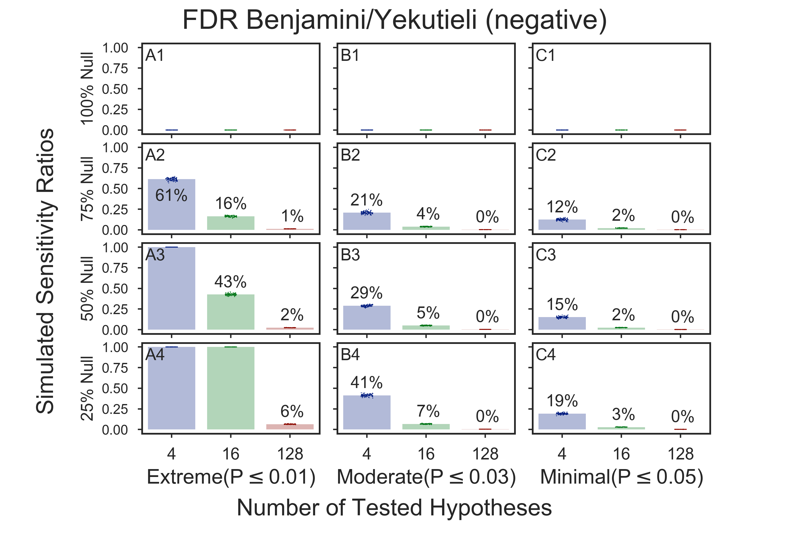
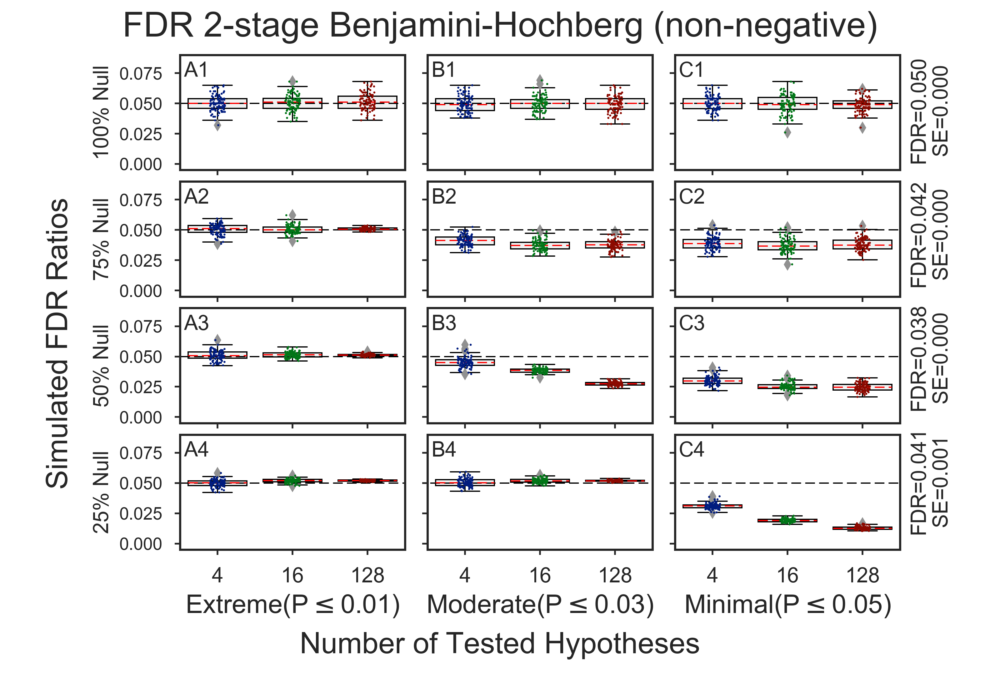
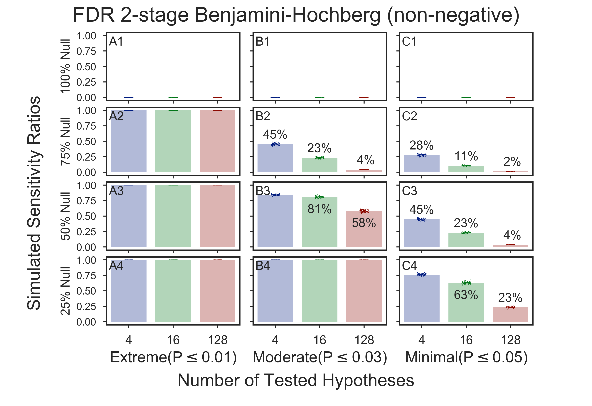
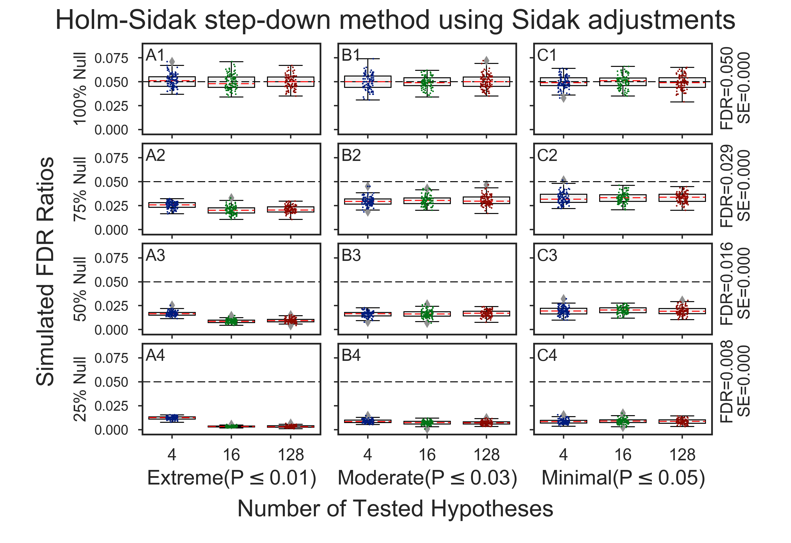
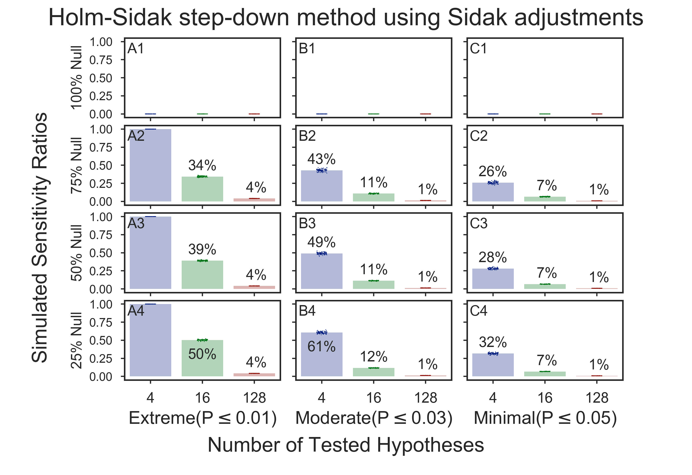
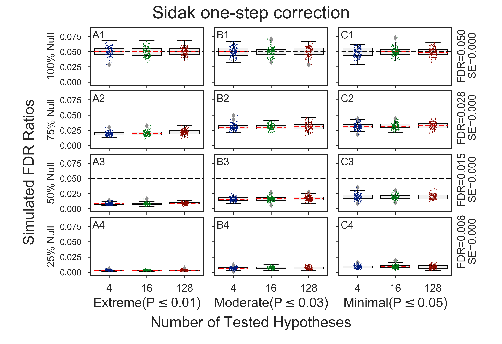
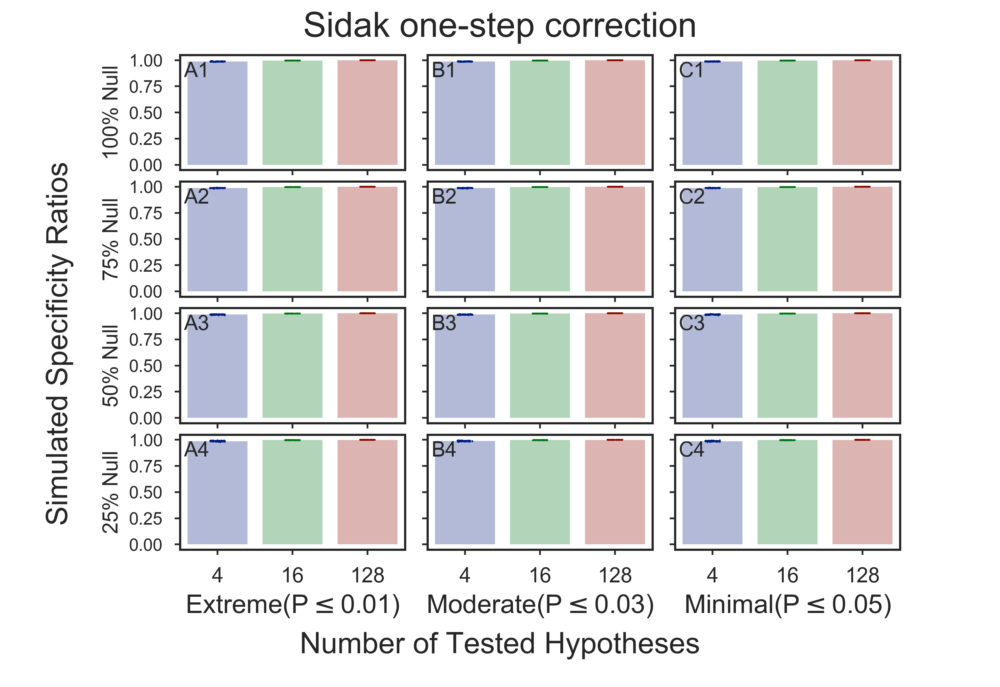

# Hypotheses Simulation Results

## Multiple-test methods
3,600,000 simulations per multiple-test simulation method were run to create each figure:    
* [**FDR vs FWER**](#fdr-vs-fwer)    
  Contrast the simulation results **False Discovery Rate** (FDR) vs **Family-wise Error Rate**
  * 0:25:03 [FDR Benjamini/Hochberg (non-negative)](#fdr-benjaminihochberg-non-negative)
  * 0:22:19 [Bonferroni one-step correction](#bonferroni-one-step-correction)
* [**Other FDR Simulation Results**](#fdr-simulation-results)
    * 0:26:00 [FDR Benjamini/Yekutieli (negative)](#fdr-benjaminiyekutieli-negative)
    * 0:24:17 [FDR adaptive Gavrilov-Benjamini-Sarkar](#fdr-adaptive-gavrilov-benjamini-sarkar)
    * 0:26:59 [FDR 2-stage Benjamini-Hochberg (non-negative)](#fdr-2-stage-benjamini-hochberg-non-negative)
    * 0:27:00 [FDR 2-stage Benjamini-Krieger-Yekutieli (non-negative)](#fdr-2-stage-benjamini-krieger-yekutieli-non-negative)
* [**Other FWER Simulation Results**](#fwer-simulation-results)
    * 0:25:50 [Holm-Sidak step-down method using Sidak adjustments](#holm-sidak-step-down-method-using-sidak-adjustments)
    * 1:18:43 [Hommel closed method based on Simes tests (non-negative)](#hommel-closed-method-based-on-simes-tests-non-negative)
    * 0:23:38 [Sidak one-step correction](#sidak-one-step-correction)
    * 0:23:36 [Simes-Hochberg step-up method (independent)](#simes-hochberg-step-up-method-independent)
    * N:NN:NN Holm step-down method using Bonferroni adjustments

## FDR vs FWER
### FDR Benjamini/Hochberg (non-negative)
    
    
    

### Bonferroni one-step correction
    
    
    

## FDR Simulation Results
### FDR Benjamini/Yekutieli (negative)
    
    
    

### FDR adaptive Gavrilov-Benjamini-Sarkar
    
    
    

### FDR 2-stage Benjamini-Hochberg (non-negative)
    
    
    

### FDR 2-stage Benjamini-Krieger-Yekutieli (non-negative)
    
    
    

## FWER Simulation Results
### Holm-Sidak step-down method using Sidak adjustments
    
    
    

### Hommel closed method based on Simes tests (non-negative)
    
    
    

### Sidak one-step correction
    
    
    

### Simes-Hochberg step-up method (independent)
    
    
    

Copyright (C) 2016-2017, DV Klopfenstein, Haibao Tang. All rights reserved
