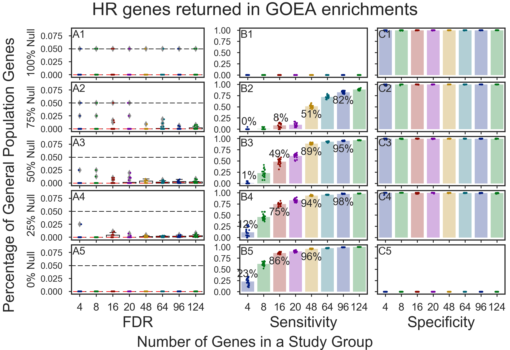
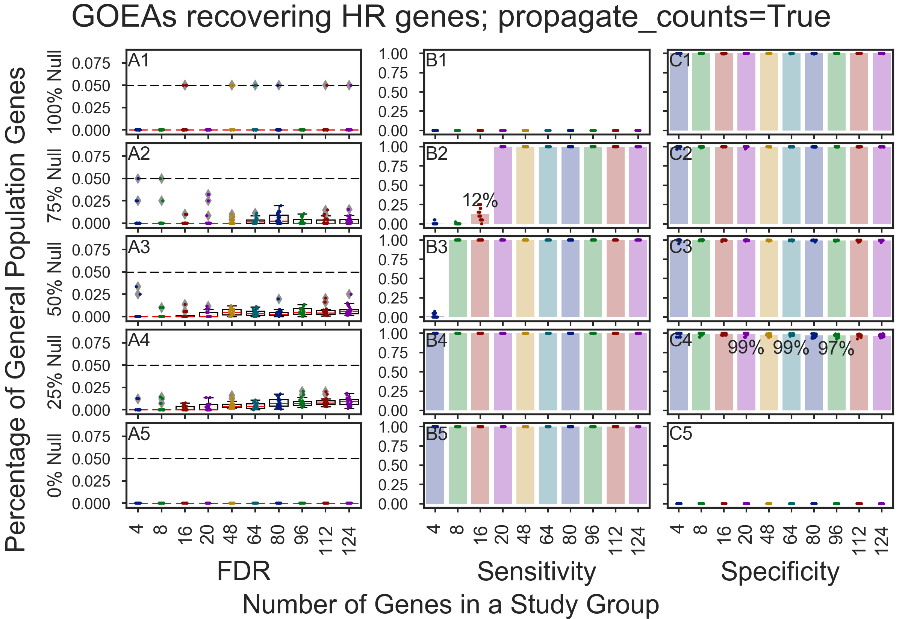
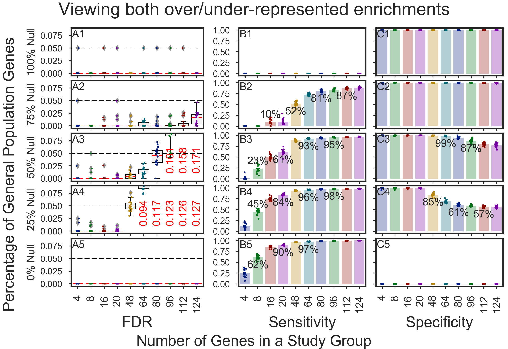
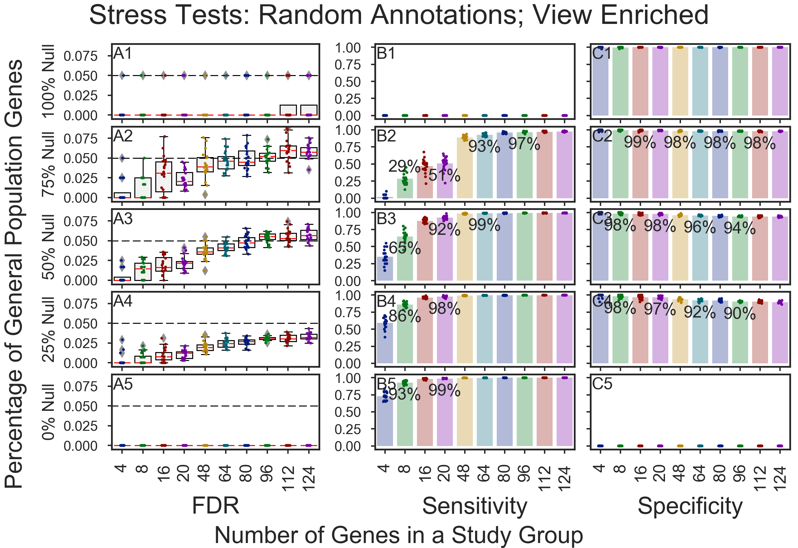

# Stochastic Simulation figures for GOATOOLS manuscript

* [Manuscript Figures](#manuscript-figures)    
  * [propagate_counts=False **Original annotations**](#goeas-recovering-humoral-response-hr-genes)    
  * [propagate_counts=True **Augmented annotations**](#goeas-recovering-hr-genes-propagate_countstrue)    
* [Supplemental Figures](#supplemental-figures)     
  * [View over/under-enrichments](#view-overunder-enrichments)    

## Manuscript Figures
**Figure 3**. Results for 20,000 GOATOOLS GOEA stochastic simulations per figure showed **varying sensitivity and consistently high specificity**, performing **better on large gene groups than on small gene groups (e.g., 4 genes)**.

GOEAs performed **well on study groups of 8+ genes** if the GOATOOLS GOEA option, **propagate_counts is set to True**.

The simulation **gene groups** ranged in **size and content**.

The group size ranged from **4 to 124 genes**.

The content ranged in percentage of targeted genes versus background genes (“True Null” or “Null” genes). Targeted genes are randomly chosen from 124 genes associated with Humoral Response (HR). Background genes are randomly chosen from the ~20k protein-coding genes which are not associated with HR. 

### GOEAs recovering Humoral Response (HR) genes
(A) Stochastic GOEAs using downloaded annotations perform well if the **gene groups are large** or if the **percentage of targeted HR genes in a gene group is over 50%**. Study groups containing **8 or less genes** have a **low probability** of revealing genes associated with truly enriched GO terms. 

### GOEAs recovering HR genes; propagate_counts=True
(B) Setting the GOATOOLS GOEA option, propagate_counts, to True, causing GO term gene annotations to be added to the GO parents up through the GO hierarchy, greatly improves the GOEA sensitivity with no degradation of the specificity, even for small gene groups.

## Supplemental Figures

### Original Annotations: View over/under-enrichments

### Randomly shuffled Annotations: View enriched results only

Copyright (C) 2016-2017, DV Klopfenstein, Haibao Tang. All rights reserved.
