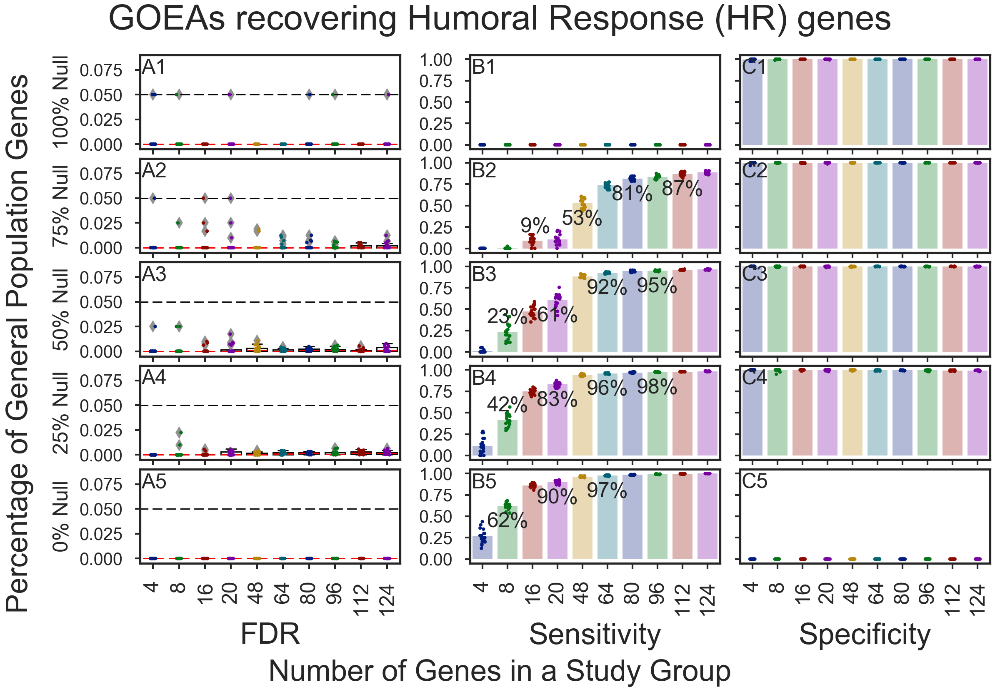

# Stochastic Simulation figures for GOATOOLS manuscript

## Manuscript
Figure 3. Results for 20,000 GOATOOLS GOEA stochastic simulations per figure showed varying sensitivity and extremely high specificity, performing better on large gene groups than on small gene groups (e.g., 4 genes). Setting the GOATOOLS GOEA option, propagate_counts to True resulted in GOEAs finding more genes associated with truly enriched GO terms, even with gene groups as small as 8 genes.
The gene groups ranged in size and content. The gene group size ranged from 4 genes up to 124 genes. The content ranged in percentage of targeted genes versus background genes (“True Null” or “Null” genes). Targeted genes are randomly chosen from 124 genes associated with Humoral Response (HR). Background genes are randomly chosen from the ~20k protein-coding genes which are not associated with HR. Targeted genes are expected to be associated with HR GO terms found significant in the simulations. Background genes are expected to be associated with GO terms which failed to be found statistically significant.

### GOEAs recovering Humoral Response (HR) genes
(A) Stochastic GOEAs using downloaded annotations perform well if the gene groups are large or if the percentage of targeted HR genes in a gene group is over 50%. Study groups containing 8 or less genes have a low probability of revealing genes associated with truly enriched GO terms. 

### GOEAs recovering HR genes; propagate_counts=True
(B) Setting the GOATOOLS GOEA option, propagate_counts, to True greatly improves the GOEA sensitivity with no degradation of the specificity, especially for small gene groups.

Copyright (C) 2016-2017, DV Klopfenstein, Haibao Tang. All rights reserved.
